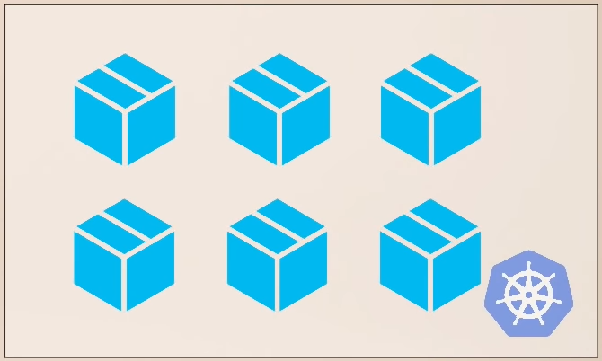

# Argo CD

[GitHub Homepage](https://argoproj.github.io/cd/) | [Alternative Homepage](https://argo-cd.readthedocs.io/en/stable/) | [Argo CD Example Apps](https://github.com/Scope-Infrastructure-Calismalari/argocd-example-apps)

*"Argo CD is a declerative, **GitOps** continuous delivery tool for Kubernetes."*

**Dikkat! GitOps aracı olan Argo CD'nin ne olduğunu okumadan önce eğer GitOps'un ne olduğunu bilmiyorsanız ilk olarak [GitOps yazımızı](GitOps.md) okumanızı rica ederiz, sonrasında bu yazı daha anlaşılır olacaktır.**

Yazının devamında daha detaylı olarak anlatılacak olan Argo CD mimarisinin bir örneğini aşağıdaki görselde görebilmekteyiz. GitOps yazısını okuduktan sonra "GitHub Repo" ifadesinin neden mimaride yer aldığını, alması gerektiğini hemen anlayabilmiş olmalıyız.

## Argo CD Nedir?
Argo CD, adından da anlaşılabileceği üzere aslında bir **C**ontinuous **D**elivery (Sürekli Teslim) aracıdır. Argo CD'yi anlamadan önce CD'nin projelere nasıl eklenip uygulandığını, ve birçok projenin ortak tercihi olan Jenkins ve GitLab gibi CI/CD araçlarının anlayıp sonrasında Argo CD'yi bunlarla kıyaslayarak devam edeceğiz.

### Birçok projede CD nasıl kullanılmaktadır?

Aşağıdaki görsellerin solundaki gibi birçok mikro servisimizin olduğunu ve sağ görseldeki gibi bunları Kubernetes(K8s) cluster'ına taşıdığımızı düşünelim.

  
  

Uygulamamızın kaynak kodunda değişiklikler yapıp (yeni özellilk eklemek veya bugfix yapmak gibi), Git repo'suna push'ladığımızı düşünelim.

Bu değişiklik ve push'lama işleminden sonra sistemimizde kurulu olan ve bu Git repos'su ile eşlenmiş olan Jenkins vb. uygulamalarımızın CI pipeline süreci otomatik olarak tetiklenecektir.

Tetiklenen bu pipeline süreci otomatik adımlarla önce uygulamamızı test sürecinden geçirecek, hata ile karşılaşmazsa yeni bir Docker imajı oluşturacak ve bunu Docker Repo'ya push'layarak CI sürecini tamamlayacaktır.

Artık önümüzde yeni bir soru var: *"Yeni oluşturulan bu Docker imajı K8s cluster'ına nasıl deploy edilecek?"*

  1. K8s deployment YAML dosyasını Docker imajının yeni versiyon numarasını yazarak güncelleriz.

  2. Değiştirilen YAML dosyasını K8s'e uygularız (apply).

Docker imajını Docker Repo'ya push'lama işlemine kadar olan basamakların tümü CI sürecini oluştururken güncellenmiş YAML dosyasını K8s cluster'ına apply etmek ise CD sürecini oluşturmaktadır.

**Bu CI/CD sürecinin zorlukları ve sıkıntıları:**

 - K8s cluster'ına erişebilmek ve değişiklikler yapabilmek için kubectl, helm gibi araçların bu örnekte Jenkins olarak varsaydığımız ve sistemimizde kullandığımız *Build Automation Tool* 'larına yüklenmesi gerekliliği

 - K8s'e erişimin sağlanması da gerekmekte çünkü kubectl yalnızca K8s client aracıdır ve K8s'e erişebilmesi için "credential"ların tanımlanması gerekmektedir. Eğer AWS gibi bulut sunucuları kullanıyorsak bunlara da erişim için ayrıca credentials tanımlamamız gerekmektedir.

 - Bu credential tanımlamaları yalnızca konfigürasyona emek vermek değil bunun yanı sıra güvenlik konusunu da gündeme getirmektedir. Cluster credential'larını external servislere ve araçlara da vermemiz gerekmektedir. Örneğin 33 adet uygulamamız varsa her uygulama kendisi için ayrıca credential talep etmektedir. Ancak bu şekilde her uygulama cluster'da kendisi için tanımlı uygulama kaynaklarına erişebilmiş olacaktır. Eğer tek bulut servisimiz değil de başka cluster'larımız da varsa bunların herbiri için de yine credential tanımlamaları gerekecektir.

 - **En önemli sorun** ise K8s'e uygulama deploy eden veya K8s konfigürasyonlarında bir değişiklik yapan Jenkins, bu deployment'ların durumları ile ilgili bilgi sahibi olamamaktadır. Bir defa "`kubectl apply ...`" komutu çalıştırıldığında Jenkins aslında bu execution'ın durumu hakkında bilgi sahibi olamamaktadır. "Uygulama kuruldu mu?", "Uygulama durumu healty mi?", veya "Uygulama başlama aşamasında hata mı verdi?" gibi soruların yanıtını Jenkins takip edememektedir.

**Bu durumlardan dolayı CI/CD sürecinin CD kısmının iyileştirilebileceğini görmekteyiz.**

İşte Argo CD bu özel durumlar göz önüne alınarak K8s cluster'larına daha efektif bir şekilde *"delivery"* yapılabilmesi için GitOps prensipleri baz alınarak geliştirildi. Argo CD için **CD for Kubernetes** diyebiliriz.

### Argo CD ile CD Sürecinin Yürütülmesi

İlk olarak Argo CD, Jenkins vb. gibi K8s cluster'ına dışarıdan erişen bir araç olmak yerine bilakis bu cluster'da kurulan ve içerisinde çalışan bir uygulamadır. Yani Argo CD K8s cluster'ının bir parçasıdır. 

Bu şekilde K8s cluster'ının içerisinde kurulmuş olmasının sağladığı en büyük avantaj: **Jenkins gibi değişiklikleri K8s'e push'lamak yerine pull etmesidir**. Zaten K8s cluster'ının içerisinde yer aldığı için aslında dışarıda Git repo'sunda yer alan ve değişikliğe uğrayan K8s manifest dosyasındaki değişikliği pull ederek K8s cluster'ına bu yeni dosyayı iletmiş olmaktadır.

Peki bunu nasıl yapabiliriz:

  1. İlk olarak Argo CD uygulamasını K8s cluster'ına deploy ediyoruz.

  2. Argo CD'yi takip etmesini istediğimiz Git repo'suna bağlayıp o repo'daki değişiklikleri anlık takip etmesini sağlıyoruz.

  3. Bu repo'da herhangi bir değişiklik olduğunda K8s cluster'ına kurduğumuz ve bu repo'yu takip etmesini söylediğimiz Argo CD uygulaması bu değişikliği kendiliğinden algılayacak ve bunu otomatik olarak K8s cluster'ına çekecektır.

Sürece en başındak baktığımızda şu şekilde özetleyebiliriz.

 1. Developer bir geliştirme veya bugfix yaparak bunu Git repo'suna push'lar.
 
 2. Jenkins vb. araçlarda tanımlanmış olan CI süreci otomatik devreye girer ve yukarıda bahsettiğimiz adımları uygulayarak yeni bir Docker imajı oluşturup K8s manifest dosyalarında, örneğin deployment.yml, değişiklik yapar.
 
 3. Argo CD ise bu değişikliği algılayıp yeni manifest dosyasını K8s cluster'ına pull eder.
 
**Best Practice for Git Repository**: Git repo'sunu *application source code* ve *application configuration* (K8s manifest files) olarak ayırmalıyız. Hatta *system configuration* için de ayrı bir repo oluşturmalıyız.

Peki neden bu yaklaşımı uygulamamız lazım? Çünkü:

 - Uygulamanın konfigurasyon kodları yalnızca deployment dosyasında değil, bununla beraber configmap, secret, service, ingress vb. dosyalarında da olup uygulamanın cluster'da çalışması için gerekli olabilir.

 - K8s manifest dosyaları kaynak kod'dan bağımsızdır. Örneğin uygulamanın service.yml dosyasında bir değişiklik yaptığımızda tüm CI sürecinin baştan başlamasını istemeyiz çünkü kodlarda bir değişiklik yapılmamıştır.

 - CI pipeline sürecine K8s manifest dosyalarının da eklersek karmaşık bir pipeline süreci oluşturmuş oluruz. 

 - Yalnızca *App Configuration* Git repo'sunu takip etmesini söylediğimiz Argo CD uygulaması, Jenkins uygulamasının CI sürecini tamamlayıp K8s manifest dosyasını (örneğin Deployment.yml) değiştirip bu repo'ya push'lamasından sonra otomatikl olarak çalışıp bunu K8s cluster'ının içine çekecektir.

Argo CD K8s manifest dosyalarının "Plain(K8s) YAML Files", "Helm Charts", "Kustomize Files" veya diğer K8s manifest dosyaları oluşturan diğer template dosyaları desteklemektedir.

Bu dosyaların olduğu ve *App Configuration* olarak adlandırığımız repo aslında GitOps repo'su olmuş olmakta ve Argo CD'ye burayı dinlemesini söylemekteyiz. Bu repo'daki dosyalar Jenkins CI süreci ile değiştirilebileceği gibi doğrudan DevOps mühendisleri tarafından da değiştirilebilecektir. 

Argo CD kurulumu ve kullanımı sonrasında artık CI ve CD pipeline'larımızı ayırmış oluyoruz. Bunun bize sağladığı avantaj ise CI süreçlerini, kodları geliştiren developer'ların yürütebilmesini ve kendi yazdıkları kodların paketlenmesini takip edebilmesini sağlamak. Aynı zamanda daha çok operasyonel işlerle ilgilenen kişilerin de developer'ların düzenlediği pipeline'lar sonucunda üretilen paketlerin alınması ve doğru şekilde çalışmasını sağlamaya odaklanabilmeleridir. Böylece farklı odakları olan iki farklı takım kendi süreçlerine odaklanabilecektir. 

Git reposunun "Single Source of Truth" olarak kullanılması aynı zamanda K8s cluster'ının tamamen şeffaf olmasını sağlamaktadır çünkü cluster'da çalışan uygulamalar, bunların ayarları vb. tüm bilgiler kod ile açıkça belirlenmiş ve Git repo'sunda kayıt altına alınmıştır. Sürüm kontrolünü zaten söylemeye gerek yok :)

Gerçekten cluster'da çok hızlı bir şekilde güncelleme yapılması gerektiği durumlarda Argo CD'nin otomatik senkronizasyonu kapatılıp manuel değişikliklere açık hale getirilebilinmekte ve manuel değişiklik yapılması durumunda dışarıya bir sinyal/uyarı gönderilebilmekte ve bu değişikliğin kodda da yapılması sağlanmaktadır.

### Faydaları

- Tüm K8s config dosyaları kod olarak tanımlanıp Git repo'sunda tutulması

- Argo CD'nin bize sağlayacağı fayda, daha önceden de GitOps yazısında belirtildiği gibi, herkesin kendi bilgisayarından çalıştırdığı "`kubectl apply ...`", "`helm install ...`" gibi komutlar yerine artık ortak Git repo'sundaki dosyalar üzerinde değişiklik yapıp bu şekilde K8s cluster'ını güncelleyebilmek

- Takımdaki tüm kişilerin aynı arayüz ile değişiklik yapabilmesinin sağlanmasıdır. "`git commit ...`" komutunun çalıştırılması yeterli olacaktır.

- **En büyük fayda ise -> "Single Source of Truth"**. Eğer takımdan biri K8s cluster'ına kendi bilgisayarından bağlanıp bir değişiklik yaparsa (bir uygulamanın replika sayısını 1'den 2'ye çıkarmak gibi), Argo CD 

### Cluster'ın Kurtarılması

Geliştirdiğimiz uygulamalarının kaynak kod'larının Git repo'sunda yer alması kodların güvenle saklanmasını, yerel makinede sorun olması/sistemin çökmesi/makinenin kaybolması durumunda bizi kurtardığı gibi cluster'ın çalıştığı bilgisayarın sorun yaşaması durumunda da bu yöntemle repo'laştırdığımız configuration dosyaları ile de cluster'ımızı aynı şekliyle yeniden ayaklandırabilmiş olacağız. Manuel değişiklikler ile ilerlenmiş olsaydı daha önceki tüm düzenlemelerin hatırlanıp tekrar yapılması gerekecekti, tabi bu ne kadar mümkün olabilirse.

Aslında bu Argo CD'nin getirdiği bir şey değil, GitOps'un sağladığı faydalardan biridir. Argo CD ise bizim GitOps prensiplerini uygulamamıza yardımcı olmaktadır.

### K8s'in Git ile Erişim Kontrolü

Git repo'su ile yönettiğimiz K8s cluster'ları için *"Cluster Role"*
ve *"User resources"* gibi tanımlamalar yapmamız gerekmeyecektir. Cluster erişimlerini direkt olarak Git ile yönetebilmiş olacağız. Örnek olarak yukarıdaki görselde de olduğu gibi tüm takıma "merge request" açma yetkisi verilebilecekken "merge" yetkisini sadece "Senior Engineers"a atayabiliriz.

Takıma sadece Git repo'suna erişim yetkisi verip K8s cluster'ına takımın erişimini tanımlamadan işlemlerimizi daha güvenli şekilde devam edebilmiş olacağız.

Bunu aynı zamanda "non-human users"a da uygulayacağız. Örneğin Jenkins gibi build automation tool'larının direkt olarak K8s erişiminin tanımlanmasına gerek olmayacaktır çünkü Argo CD zaten cluster'ın içinde çalışmaktadır ve değişik değişiklikleri cluster'a uygulayan tek o olacaktır.

**Özetle** artık cluster credential'larının cluster dışında olmasına gerek yoktur çünkü zaten agent cluster'ın içinde çalışmaktadır. Bu bize tüm cluster'ların güvenliğinin yönetiminin de basitleşmesini sağlamaktadır.

### K8s Eklentisi Olarak Argo CD

Argo CD yalnızca K8s cluster'ına deploy edilmiş bir uygulama değildir, eğer böyle olmuş olsaydı Jenkins de aynı şekilde içeri deploy edilebildiğinden bir farkları olmamış olacaktı. Argo CD'nin burada farklılaşmasını sağlayan şey aslında K8s API'ının bir uzantısı olmasıdır. Aslında Argo CD bir şeyleri yeniden inşa etmek, tüm fonksiyonları yeniden sunmak yerine K8s'in fonksiyonlarına katkı sağlayıp zenginleştirmektedir. Kendi işlemlerini yapabilmek için de K8s'in fonksiyonlarını kullanmaktadır, örneğin verileri saklamak için *"etcd"* kullanmaktadır. 

Argo CD'nin bize büyük avantaj sunmasını sağlayan şeylerden biri de aslında K8s'in kontrolcülerini kullanmasıdır. Bu sayede K8s'in anlık durumunu takip edebilmekte, istenen durum ile anlık durumu kıyaslayabilmektedir. Bu sayede Jenkins'in bize sunamadığı "Visibility in the cluster"ı da sunabilmektedir. Yeni bir uygulama deploy edildiğinde pod'un oluşturulma durumunu, uygulamanın sağlık durumunu (healty status), pod'un fail olma durumunu, rollback ihtiyacı olup olmadığını Argo CD UI ile takip edebilmiş olacağız. 

Eğer büyük resme bakarsak, aslında bir tarafta Git repo'muz, diğer tarafta K8s cluster'ı ve bu ikisinin tam ortasında ise Argo CD yer almakta. Git repo'su burada **istenen durum**u, K8s cluster'ı ise **gerçekte çalışan durum**u belirtmektedir. Argo CD ise bu ikisinin senkronize olduğundan emin olmak ile yükümlüdür. İkisi arasında ayrılık/farklılık olduğu durumda ilk fırsatta güncelleme yapmaktadır.

*Notların çıkarılmasına kaynaklık eden YouTube videosuna (ArgoCD Tutorial for Beginners | GitOps CD for Kubernetes) [buradan](https://www.youtube.com/watch?v=MeU5_k9ssrs&ab_channel=TechWorldwithNana) ulaşabilirsiniz.*

## Kurulum (Yerel makina)

*Not: Bu uygulama kişisel bilgisayar üzerine yüklenmiş olan Ubuntu 20.04 LTS üzerine kurulmuştur. Farklı işletim sistemleri için bazı adımlar/komutlar değişecektir fakat kurulumun ana mantığu/iskeleti burada tanımlandığı gibidir· Kurulum adımlarına Argo CD'nin [Getting Started](https://argo-cd.readthedocs.io/en/stable/getting_started/) bağlantısından da ulaşabilirsiniz.*

Argo CD uygulaması "minikube" uygulaması üzerinde çalışan Kubernetes cluster'ına kurulmuş ve orada çalıştırılmıştır.

1. Minikube uygulaması başlatılır:

    `minikube start`

    *Eğer minikube kurulu değilse diğer adımlara geçmeden önce [buradaki](https://www.linuxtechi.com/how-to-install-minikube-on-ubuntu/) adımları takip edip kurulumu tamamlamalısınız*

2. Argo CD uygulaması için namespace tanımlanır:

    `kubectl create namespace argocd`

3. Argo CD kurulumu yapılır:

    `kubectl apply -n argocd -f https://raw.githubusercontent.com/argoproj/argo-cd/stable/manifests/install.yaml`

    Not: Load Balancer yapı için farklı kurulum URL'i gerekmektedir.

4. Kurulumun doğru yapılıp yapılmadığını şu şekilde kontrol edebiliriz:

    `kubectl -n argocd get all`

    Eğer kurulum doğru şekilde tamamlanmışsa karşımıza şuna benzer sonuçlar gelecektir:

        NAME                                                       READY   STATUS    RESTARTS   AGE
        pod/argocd-application-controller-***                      1/1     Running   0          3h32m
        pod/argocd-applicationset-controller-***                   1/1     Running   0          3h32m
        pod/argocd-dex-server-***-djnpt                            1/1     Running   0          3h32m
        pod/argocd-notifications-controller-***                    1/1     Running   0          3h32m
        pod/argocd-redis-***                                       1/1     Running   0          3h32m
        pod/argocd-repo-server-***                                 1/1     Running   0          3h32m
        pod/argocd-server-***                                      1/1     Running   0          120m

        NAME                                                       TYPE        CLUSTER-IP       EXTERNAL-IP   PORT(S)                      AGE
        service/argocd-applicationset-controller                   ClusterIP   XX.XX.XX.XX      <none>        7000/TCP                     3h32m
        service/argocd-dex-server                                  ClusterIP   XX.XX.XX.XX      <none>        5556/TCP,5557/TCP,5558/TCP   3h32m
        service/argocd-metrics                                     ClusterIP   XX.XX.XX.XX      <none>        8082/TCP                     3h32m
        service/argocd-notifications-controller-metrics            ClusterIP   XX.XX.XX.XX      <none>        9001/TCP                     3h32m
        service/argocd-redis                                       ClusterIP   XX.XX.XX.XX      <none>        6379/TCP                     3h32m
        service/argocd-repo-server                                 ClusterIP   XX.XX.XX.XX      <none>        8081/TCP,8084/TCP            3h32m
        service/argocd-server                                      ClusterIP   XX.XX.XX.XX      <none>        80/TCP,443/TCP               3h32m
        service/argocd-server-metrics                              ClusterIP   XX.XX.XX.XX      <none>        8083/TCP                     3h32m

        NAME                                                       READY   UP-TO-DATE   AVAILABLE   AGE
        deployment.apps/argocd-applicationset-controller           1/1     1            1           3h32m
        deployment.apps/argocd-dex-server                          1/1     1            1           3h32m
        deployment.apps/argocd-notifications-controller            1/1     1            1           3h32m
        deployment.apps/argocd-redis                               1/1     1            1           3h32m
        deployment.apps/argocd-repo-server                         1/1     1            1           3h32m
        deployment.apps/argocd-server                              1/1     1            1           3h32m

        NAME                                                       DESIRED   CURRENT   READY   AGE
        replicaset.apps/argocd-applicationset-controller-***       1         1         1       3h32m
        replicaset.apps/argocd-dex-server-***                      1         1         1       3h32m
        replicaset.apps/argocd-notifications-controller-***        1         1         1       3h32m
        replicaset.apps/argocd-redis-***                           1         1         1       3h32m
        replicaset.apps/argocd-repo-server-***                     1         1         1       3h32m
        replicaset.apps/argocd-server-***                          0         0         0       3h32m
        replicaset.apps/argocd-server-***                          1         1         1       120m

        NAME                                                       READY   AGE
        statefulset.apps/argocd-application-controller             1/1     3h32m

5. Cluster'da pod'da çalışan uygulamaya erişebilmek için servis tanımlanması gerekmektedir.Load Balancer, ingress gibi farklı seçenekler mevcut. Biz bu anlatımda *Port Forwarding* kullanacağız:

    `kubectl port-forward svc/argocd-server -n argocd 8080:443`

    Bu komut ile Argo CD'nin API sunucusuna https://localhost:8080 bağlantısını kullanarak erişebilmiş olacağız.

    - LoadBalancer için:

        argocd-server servisinin tipini LoadBalancer olarak değiştirmeliyiz:

        `kubectl patch svc argocd-server -n argocd -p '{"spec": {"type": "LoadBalancer"}}'`

    - Ingress için:

        Argo CD'nin ingress ile konfigüre edilmesini anlatan doküman için bağlantı: https://github.com/argoproj/argo-cd/blob/master/docs/operator-manual/ingress.md

    **Eğer bu adıma kadar sorunsuz ilerleyebildiysek localhost bağlantısına tıkladığımızda ekranımıza aşağıdaki gibi bir sayfa gelecektir.**

 

6. Varsayılan kullanıcı adı olarak "admin" ile gelen Argo CD uygulaması, kullanıcı şifresini ise kurulum anında oluşturmaktadır. Initial password'e ise şu şekilde ulaşılabilir:

###    **Argo CD versiyon 1 için:**

    - Aşağıdaki komut ile argocd namespace'indeki tüm kurulumları listeyelim pod'lardan *argocd-server* olanını filtreliyoruz.

    `kubectl -n argocd get all | grep pod/argocd-server`

    Çıktı olarak bize dönecek sonuç:

       pod/argocd-server-77b597bc68-w52zp      1/1     Running     0     148m

    Burada "pod/" kısmından sonraki kısım bizim initial password'ümüzdür.

    **Dikkat!!**

    Muhtemelen versiyon farkından kaynaklanan nedenlerden dolayı artık initial password'e bu şekilde ulaşılamamaktadır, onun yerine direkt bu şifreyi kendi istediğimiz şifre ile değiştirebiliriz.

    `kubectl -n argocd patch secret argocd-secret \\n  -p '{"stringData": {\n    "admin.password": "XXXXXXXXXXXXX",\n    "admin.passwordMtime": "'$(date +%FT%T%Z)'"\n  }}'`

    Buradaki *admin.password* 'den sonra *XXX* ile belirtilen yere kendi **encrypt edilmiş** şifremizi yazmamız gerekmektedir.

    Şifrenin **Bcrypt** şifreleme yöntemi kullanılarak şifrelenmesi gerekmektedir. Bunu yapabilmek için [browserling](https://www.browserling.com/tools/bcrypt) adresine gidip Password kısmına belirlediğimiz şifreyi yazıp **Bcrypt** butonuna basarak şifreleme işlemini gerçekleştirebiliriz.

  Oluşturulan bu şifreyi kopyalayıp yukarıdaki komuttaki "XXXXXXXXXXXXX" kısmının yerine yazıp çalıştırdığımızda şifre değiştirme işlemi başarıyla tamamlanmış olacaktır.

  Şifre değiştiği için Argo CD uygulamasının servide deployment'ını yeniden başlatmamız gerekmektedir:

  `kubectl -n argocd rollout restart deployment argocd-server`

  Yeniden başlatma nedeniyle durmuş olan *port-forwarding* işlemini yeniden başlatıyoruz:

  `kubectl port-forward svc/argocd-server -n argocd 8080:443`

  Bu komuttan sonra şu şekilde bir çıktı oluşacaktır:

    deployment.apps/argocd-server restarted

###  **Argo CD versiyon 2 için:**

  Şifre yine otomatik olarak *"argocd-initial-admin-secret"*  isminde bir secret olarak oluşturulmuştur.

  `kubectl get secret argocd-initial-admin-secret -n argocd -o yaml` komutunu çalıştırıp *data* -> *password* altında şifremizin base64 ile encode edilmiş halini görebiliriz. 

  `echo <encoded-sifre> | base64 --decode` komutu ile de şifremizi decode edip çıktısını doğrudan terminalde görebiliriz. '%' işaretinden önceki kısım şifremizdir, **'%' karakterini kopyalamamaya dikkat ediniz!**

7. Bu aşamaları sıkıntısız geçebildiysek artık localhost:8080 ile yeniden uygulamamıza erişip kendi belirlediğimiz ve bcrypt ettiğimiz şifre ile giriş yapabilmemiz gerekmekte. Giriş işlemi başarıyla sonuçlanırsa karşımıza şu şekilde bir ekran gelecektir:

8. Tebrikler. Kurulum işlemini başarıyla tamamladınız. Bir sonraki adımda bu boş ekranı uygulamalarla doldurup biraz hareketlendireceğiz :)

## Örnek Çalışma

*Bu örnekte K8s konfigürasyon değişiklikleri için Argo CD uygulaması ile tam otomatik CD pipeline'ının kurulması ve çalıştırılmasını göreceğiz*

Bu örnek uygulamada bize gerekenler:

- "Deployment" ve "service" yaml dosyalarını içeren Git repo'su

- Örnekte kullanılacak olan Docker imajlarını içeren Docker Hub repo'su

- İçerisi boş olan Minikube cluster'ı

Bu örneğin tamamlanması için gerçekleştirilecek adımlar:

1. Install Argo CD in K8s cluster

2. "Aplication" CRD ile Argo CD'nin konfigüre edilmesi

3. *Deployment.yaml* dosyasını güncelleyerek kurulumun test edilmesi

 

## 1. Adım - Install ArgoCD in K8s cluster

Kurulum adımlarının anlatıldığı internet sayfasına [buradan](https://argo-cd.readthedocs.io/en/stable/getting_started/#1-install-argo-cd) ulaşabilirsiniz.

 - K8s cluster'ının içerisine Argo CD namespace'i oluşturuyoruz:

    `kubectl create namespace argocd`

 - Namespace içerisine Argo CD uygulamasının kurulumunu yapıyoruz

    `kubectl apply -n argocd -f https://raw.githubusercontent.com/argoproj/argo-cd/stable/manifests/core-install.yaml` 

  Kurulum sonucunu görebilmek için `kubectl get pod -n argocd` komutunu çalıştırıp çıktıları görebiliriz.

Tüm pod'ların çalışır duruma geçmesini beklemeliyiz. `kubectl get pod -n argocd -w` komutu ile gözlemleme(watch) konumuna geçip kolayca takip edebiliriz.

### Argo CD UI'ına Erişmek

  K8s cluster'ında çalışan Servisleri `kubectl get svc -n argocd` komutu ile incelediğimizde *argocd-server* servisinin *80* ve *443* portlarının açık olduğunu gözlemleyebiliriz.

  Bu port'ları kendi makinemizin port'larına yönlendirip UI'a erişebilir hale geleceğiz.

  `kubectl port-forward -n argocd svc/argocd-server 8080:443`

  Bu komut ile bu servise artık localhost üzerinden erişebilir hale gelmiş olduk. 

Artık [localhost:8080](localhost:8080) veya [127.0.0.1:8080](127.0.0.1:8080) adresleri ile service erişebiliriz

Aşağıdaki gibi güvensiz bağlantı uyarısı alınılması durumunda *Advanced -> Proceed to 127.0.0.1 (unsafe)* şeklinde ilerleme yapılarak bağlantıya erişebilir olmuş olacağız.

Artık Argo CD uygulamasının UI'ı önümüze gelecektir:

Yukarıda bahsedilen ve kurulum adımlarının anlatıldığı [internet sitesi](https://argo-cd.readthedocs.io/en/stable/getting_started/#1-install-argo-cd) üzerindeki *4. Login Using The CLI* başlığı altında sisteme nasıl giriş yapıldığı anlatılmaktadır, biz de burada bahsedeceğiz. Yeni güncellemeler sonrası buradaki giriş yöntemi değişirse (ki önceden bu durum olmuştu) o zaman bahsi geçen internet sitesinden yeni yöntemi denemeniz faydalı olacaktır.

Username'in *admin* olarak tanımlandığı sistemin şifresi ise Argo CD kurulumu yapılırken oluşmaktadır. Şifre *argocd-initial-admin-secret* ismiyle oluşturulan secret içerisinde saklanmaktadır.

Secret'ı ekrana yaml olarak bastırıyoruz:

`kubectl get secret argocd-initial-admin-secret -n argocd -o yaml`

*data*'nın altında yer alan *password*'ün karşısında yazan şifre bilgisi base64 encode değeridir. Bu değeri decode edip şifreye ulaşabileceğiz:

`echo <encoded_password_value> | base64 --decode`

**%** işaretini dikkate almadan önceki değerleri kopyalayarak şifreyi elde etmiş oluruz. Username'i admin olan kullanıcının *initial password* değerine de bu şekilde ulaşmış olduk. 

Giriş yaptıktan sonra Argo CD'nin boş UI ekranı önümüze gelecektir.

 

## 2. Adım - Configure Argo CD with "Application" CRD

Bu adımda konfigürasyon dosyalarının yer aldığı Git repo'sunun Argo CD ile bağlantısını sağlayacak olan konfigürasyon dosyasını yazıp bağlantıyı tamamlayacağız (Argo CD'nin konfigurasyon dosyası da yine bu konfigurasyon repo'sunda olacaktır.)

Config repo: [https://github.com/Scope-Infrastructure-Calismalari/argocd-app-config](https://github.com/Scope-Infrastructure-Calismalari/argocd-app-config)

Docker repo: [https://hub.docker.com/repository/docker/scopeinfra/argocd-app](https://hub.docker.com/repository/docker/scopeinfra/argocd-app)

Argo CD konfigürasyonunu yazarak işe başlayabiliriz, dosya ismimiz application.yaml. Konfigurasyon aslında çok basit. Custom components'ler (veya Custom Resource Definitions - CRD'lar) için apiVersion projenin kendi versiyonu olacaktır. 

**Dikkat: Bu örnekte `argoproj.io/v1alpha1` olarak tanımlanan versiyon Argo CD projesinin yeni versiyonları çıktıkça değiştirilmelidir, bu yüzden bu örnek denendiği zaman bu alan kontrol edilip yenilenmelidir!**

Versiyon kontrolü için [Declarative Setup](https://argo-cd.readthedocs.io/en/stable/operator-manual/declarative-setup/) bağlantısı altındaki *Applications* başlığının altındaki dosya örnek alınabilir.

Dosyamızın ilk satırları aşağıdaki gibidir. Bu satırlar ile uygulamanın konponent'leri Argo CD uygulamasının çalıştığı namespace'in altında oluşturulmasını sağlayacaktır. 

Kodları yazmaya *spec* ile devam ediyoruz. spec altındaki *project* birden fazla uygulamayı gruplamamızı sağlamakta. Bu bizim için önemli değilse *default* yazıp devam edebiliriz. Eğer bu satırı hiç yazmaz, tanımlama yapmak isek o zaman da *default* olarak kabul edilecektir.

Buradan sonra ise tüm Argo CD uygulamalarını oluştururken gerekli iki adıma geçiyoruz. İlk olarak; Argo CD'nin bağlanacağı ve senkronizasyon sağlayacağı Git repo'su, ikinci olarak ise Git repo'sunda bulduğu tanımlamaları uygulayacağı destination(K8s cluster) bilgisi. 

**Source**
- *repoURL* ile Git repo'sunun bağlantısı tanımlanır.
- *targetRevision: HEAD* tanımlaması ise Argo CD'nin her zaman son commit'i almasını sağlar.
- *path: dev* ise repo içerisindeki senkronize etmek veya takip etmek istediğimiz spesifik bir path tanımlamamızı sağlar. Bizim örneğimizde bu *dev* klasörüdür. 

**Destination**
- *server* K8s cluster'ının kendi adresini tanımladığımız yer. `https://kubernetes.default.svc` adresi K8s API server'ın internal adresidir.

*Not: Argo CD K8s cluster'ının içerisinde çalıştığı için cluster'ın API server'ına erişmesi için internal IP adresi yeterlidir, external cluster endpoint'e gerek yoktur. Argo CD cluster'a dışarıdan erişebileceği veya birden çok cluster'ı yönetebileceği için böyle bir tanımlama vardır ama bizim örneğimizde internal adres yeterli olmaktadır.*

- *namespace* alanı ile de Argo CD'nin Git repo'sunda bulduğu konfigurasyon dosyalarını nereye uygulayacağını tanımlamış oluyoruz. *myapp* olarak tanımlayınca tüm konfigurasyonların myapp isimli namespace'de oluşturulmasını sağlamış oluyoruz.

  
  

Daha önceden myapp isimli bir namespace tanımlaması yapmamıştık, bu durumda Argo CD uygulamayı deploy etmeyi denediğinde hata alacaktır. Bunun önüne geçmek için *syncPolicy* altında *syncOptions* altında *- CreateNamespace=true* ile destination cluster'da bu namespace'in olacağından emin olmuş olduk.

**Dikkat: Argo CD uygulaması bu dokümanda sürekli "Otomatik olarak Git repo'sunu dinler" olarak anlatılmış olsa da bu özelllik defaukt olarak kapalı gelmektedir, bunu şu şekilde açıyoruz:**

*"automated"* başlığı altında iki ayarın tanımlaması yapılabilmektedir. *"selfHeal"* ile Argo CD uygulamasına uygulanan tüm manuel değişikliklerin geri alınması veya üzerinde yazılması sağlanmaktadır. Bu "*Single Source of Truth*"un gerçekleşmesini sağlayacaktır. Yani sadece repo'da yer alan bilgiler Argo CD için geçerli olacaktır, manuel değişiklikler kaldırılıp asıl hale dönülecektir. 

*automated* ile ayarlamasını yaptığımız Argo CD, her 3 dakikada bir Git repo'sunu kontrol edip eğer kendi anlık durumu ile farklılık varsa bu farklılıkları giderip kendini Git repo'sunda yer alan ayarlara göre yapılandıracaktır.

*Not: Eğer 3 dakika beklemek yerine Argo CD'nin değişiklikten anında bilgilenmesini istiyorsak bunun için "Git webhook" kullanılabilir. *

Peki otomatik senkronizasyon, kendini iyileştirme, prune etme gibi özellikler neden kapalı gelmektedir?

Tam cevabını bilemesem de bu muhtemel olarak "güvenlik" altında düşünülüp uygulanmış kararlardır. Böylece bazı şeylerin yanlışlıkla silinmesi sonucu bizim dışarıdan enable etmemizin gerekmemekte olacak, bazı durumlarda da  denediğimiz ayarların otomatik senkronizasyon nedeniyle silinip deneme-yanılma yapmamızı engelleyeceğinden bunların önüne geçilmiş olacaktır.

**aplication.yaml** dosyamızın yazımını bitirip tamamladıktan sonra ilk ve son defa çalıştırmamız gereken komut ile bu yaml dosyamızı cluster'a uygulayacağız. Aşağıdaki çıktıdan da görebilceğimiz üzere application component oluşturulmuş oldu.

Uygulamamız şu anda cluster içerisinde çalışmaktadır.

Eğer buraya kadarki adımları başarı ile tamamlayabildiysek localhost üzerinden Argo CD uygulamasına eriştiğimizde aşağıdaki gibi bir ekran bizi karşılayacak ve cluster'a kurulmuş olan uygulamamız gözükecektir:

Kuruluma tıkladığımızda ise kurulmuş olan tüm component'leri görebileceğiz:

Deployment'ın altındaki "rs" ile belirtilen "replica set"e bağlı olan iki pod göreceğiz:

Bu *"deployment.yaml"* dosyası içerisinde "spec" başlığı altında "replicas: " alanını "2" olarak tanımlamamızdan kaynaklanmaktadır. Verdiğimiz sayıya göre oluşturulan replica'ları bu aşamada UI üzerinden görebilmiş olduk.

Pod'lardan birinin üzerine tıkladığımızda "main data" bilgisini, pod'un hangi Docker imajı ile çalıştığını, "actual state manifest (live manifest)" bilgilerini görebileceğiz. Pod'un gerçekleştirdiği event'leri ve bunların log bilgilerini de yine bu pencereden bulabiliriz.

 

## 3. Adım - Test our setup by updating Deployment.yaml file

Git repo'muzda yer alan *dev* klasörü altındaki *deployment.yaml*'da yapacağımız değişiklikler Argo CD bu repo ile senkronize çalıştığı için uygulamaya otomatik yansıyacaktır. Örneğin bu dosyadaki *spec:* altındaki *containers:* altındaki *image* satırındaki *"scopeinfra/argocd-app:1.0"* satırını **1.0**'dan **1.2**'ye alıp tekrardan GitHub'a push'larız.

Bu değişiklikten sonra Argo CD'nin bu değişikliği algılayıp deploy ettiğimiz uygulamayı değiştirmesi gerekiyor. Bunun için 3 dakika süre boyunca bekleyebiliriz veya Argo CD uygulama sayfasında yer alan "Sync" butonuna basarak senkronizasyonu kendi elimizle tetikleyebiliriz.

Tetikleme sonrasında yeni bir *replica set (rs)* oluşturulacak ve buna bağlı iki yeni pod oluşacaktır. Bu yeni pod'lar Git repo'sundaki deployment.yaml ile ayarladığımız üzere scopeinfra/argocd-app Dcoker image'ının **1.2** versiyonu ile ayağa kalkacak olup eski image tag'ini kullanan diğer iki pod ise kaldırılacaktır (Kaldırılan pod'ların bağlı olduğu rs'in silinmediği gözlemlenmiştir, nedeni için araştırma yapılması ve onun da silinmesinin ayarlanması gerekmektedir). 

`kubectl edit deployment -n myapp myapp` komutu ile deployment bilgilerini düzenleyebilir, replica sayısını 2'den 4'e çıkarıp deneme yapabiliriz. Yaptığımız bu manuel değişiklik ise senkronizasyon sonucunda geri alıcak veya üzerinde yazılacak, replica sayısı tekrar 2 olacaktır.

 

## Kurulum (Bulut)

### Bu başlık altında K8s cluster'ına Argo CD'nin nasıl kurulacağı anlatılacaktır. Adımlar şu şekilde:

### 1 - Rancher'a bağlanılıp sağ üstteki buton ile terminal çalıştırılır.

### 2 - `kubectl create namespace` ile yeni bir namespace oluşturulur.

Yeni namespace bir projeye dahil edilmek istenirse sol menüdeki *Cluster*'a, sonra *Projects/Namespaces*'a tıklanır. Sağ üstteki kutucuktan filtreleme yapılıp namespace bulunduktan sonra sağ tarafta yer alan 3 noktaya basılıp *Edit Config* butonuna tıklanır.

Daha sonra ise sağ üstteki *Projects* açılır menüsünden ilgili proje seçilir.

### 3 - Oluşturulan namespace'e Argo CD kurulur.

Sol menüdeki *Apps & Marketplace* altındaki *Charts* butonuna tıklanır ve açılan ekrandan sağ üstteki filtreleme kutusu ile argo cd filtrelenip çıkan kutucuğa tıklanır.

Daha sonra çıkan dokümanın sağ üzerinde yer alan mavi *Install* butonuna tıklanır.

Ekrana gelen yükleme adımında daha önceden oluşturduğumuz namespace seçilip uygulamaya bir isim verilir.

Sağ alttaki *Next* butonu ile devam edilir ve sonrasında *Install* butonu ile kurulum işlemi başlatılır.

Kurulum başarı ile tamamlandığında terminalde şu şekilde çıktılar oluşacaktır:

Bu komutları kullanarak ileride uygulamamıza ve ilk şifremize erişeceğiz. O yüzden terminali kapatmamayı tercih etmelisiniz :)

### 4 - Kurulan servisi dışarıdan erişilebilir hale getirilir.

`kubectl get all --namespace scope-argocd` komutu ile *scope-argocd* namespace'ine kurulan tüm uygulamalar sıralanır. Şu an bizim için önemli olan *service/* ile başlayanlar. 

Buradan *service/argo-cd-server* satırı bulunur. Bu servisin tipi ClusterIP olarak gözükmektedir. Bunu **NodePort**'a çevireceğiz.

`kubectl edit svc argo-cd-server --namespace scope-argocd` komutu ile servisin yaml dosyası **Vi** ile açılmış olunur.

Burada *spec* altındaki *type* anahtarının değeri silinip *NodePort* yazılır ve kaydedilip çıkılır.

Artık servisimiz NodePort olarak gözükecektir:

Yukarıdaki görselde de gözüktüğü üzere artık *Port(s)* kısmında servisin port'ları "80/TCP,443/TCP" olarak görünmeyip **"80:32057/TCP,443:30456/TCP"** olarak gözükmektedir. Bu da şu anlama gelmektedir: **Herhangi bir worker node'un IP'sini tarayıcımıza yazıp bu port ile bağlandığımızda Argo CD uygulamamızın UI'ına erişmiş olacağız**

`kubectl get nodes -o wide` komutu ile node'larımızı listeliyoruz. 

Herhangi birinin *INTERNAL-IP* bilgisini alıp tarayıcımıza yazıyoruz ve yukarıdaki adımda oluşan iki yeni port'tan birini yazıyoruz, örneğin; **"10.13.224.1:30456"**

Çıkan ekrandan Advanced'e tıklayıp sonrasında ise Proceed'e tıklayarak Argo CD uygulamasının UI'ına nihayetinde erişiyoruz :)

### 5 - İlk şifrenin elde edilmesi

Argo CD kurulurken yetkili kullanıcıyı ve şifresini kendi oluşturup base64 ile decode edip opaque secret olarak saklamaktadır. Bu secret'ı elde edip decode ederek ilk şifremize ulaşmış olacağız.

Hatırlayacağımız üzere Argo CD kurulumu terminalden bize gösterilirken kurulum tamamlandıktan sonra ekranda bazı komutlar belirmişti. İşte bu komutu kullanarak şifremizi doğrudan elde edip UI ekranından giriş yapacağız. Root username'i **admin** olan kullanıcımızın şifresi ise şu komutla elde edilmektedir: `echo "$(kubectl -n scope-argocd get secret argocd-secret -o jsonpath="{.data.clearPassword}" | base64 -d)"`
Bu şifreyi ekrana girip uygulamaya erişim sağlanabilinmektedir.

