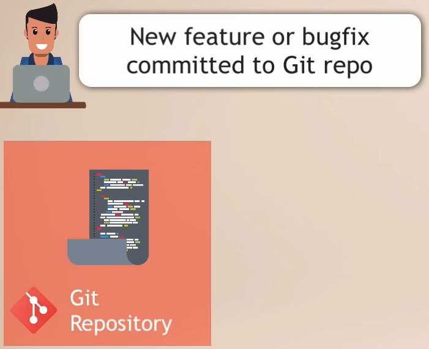

# Argo CD

[GitHub Homepage](https://argoproj.github.io/cd/) | [Alternative Homepage](https://argo-cd.readthedocs.io/en/stable/) | [Argo CD Example Apps](https://github.com/Scope-Infrastructure-Calismalari/argocd-example-apps)

*"Argo CD is a declerative, **GitOps** continuous delivery tool for Kubernetes."*

**Dikkat! GitOps aracı olan Argo CD'nin ne olduğunu okumadan önce eğer GitOps'un ne olduğunu bilmiyorsanız ilk olarak [GitOps yazımızı](GitOps.md) okumanızı rica ederiz, sonrasında bu yazı daha anlaşılır olacaktır.**

Yazının devamında daha detaylı olarak anlatılacak olan Argo CD mimarisinin bir örneğini aşağıdaki görselde görebilmekteyiz. GitOps yazısını okuduktan sonra "GitHub Repo" ifadesinin neden mimaride yer aldığını, alması gerektiğini hemen anlayabilmiş olmalıyız.

 

## Argo CD Nedir?
Argo CD, adından da anlaşılabileceği üzere aslında bir **C**ontinuous **D**elivery (Sürekli Teslim) aracıdır. Argo CD'yi anlamadan önce CD'nin projelere nasıl eklenip uygulandığını, ve birçok projenin ortak tercihi olan Jenkins ve GitLab gibi CI/CD araçlarının anlayıp sonrasında Argo CD'yi bunlarla kıyaslayarak devam edeceğiz.

### Birçok projede CD nasıl kullanılmaktadır?

Aşağıdaki görsellerin solundaki gibi birçok mikro servisimizin olduğunu ve sağ görseldeki gibi bunları Kubernetes(K8s) cluster'ına taşıdığımızı düşünelim.

  
  

Uygulamamızın kaynak kodunda değişiklikler yapıp (yeni özellilk eklemek veya bugfix yapmak gibi), Git repo'suna push'ladığımızı düşünelim.

  

Bu değişiklik ve push'lama işleminden sonra sistemimizde kurulu olan ve bu Git repos'su ile eşlenmiş olan Jenkins vb. uygulamalarımızın CI pipeline süreci otomatik olarak tetiklenecektir.

  

Tetiklenen bu pipeline süreci otomatik adımlarla önce uygulamamızı test sürecinden geçirecek, hata ile karşılaşmazsa yeni bir Docker imajı oluşturacak ve bunu Docker Repo'ya push'layarak CI sürecini tamamlayacaktır.

  

Artık önümüzde yeni bir soru var: *"Yeni oluşturulan bu Docker imajı K8s cluster'ına nasıl deploy edilecek?"*

  1. K8s deployment YAML dosyasını Docker imajının yeni versiyon numarasını yazarak güncelleriz.

  

  2. Değiştirilen YAML dosyasını K8s'e uygularız (apply).

Docker imajını Docker Repo'ya push'lama işlemine kadar olan basamakların tümü CI sürecini oluştururken güncellenmiş YAML dosyasını K8s cluster'ına apply etmek ise CD sürecini oluşturmaktadır.

  

**Bu CI/CD sürecinin zorlukları ve sıkıntıları:**

 - K8s cluster'ına erişebilmek ve değişiklikler yapabilmek için kubectl, helm gibi araçların bu örnekte Jenkins olarak varsaydığımız ve sistemimizde kullandığımız *Build Automation Tool* 'larına yüklenmesi gerekliliği

 - K8s'e erişimin sağlanması da gerekmekte çünkü kubectl yalnızca K8s client aracıdır ve K8s'e erişebilmesi için "credential"ların tanımlanması gerekmektedir. Eğer AWS gibi bulut sunucuları kullanıyorsak bunlara da erişim için ayrıca credentials tanımlamamız gerekmektedir.

 - Bu credential tanımlamaları yalnızca konfigürasyona emek vermek değil bunun yanı sıra güvenlik konusunu da gündeme getirmektedir. Cluster credential'larını external servislere ve araçlara da vermemiz gerekmektedir. Örneğin 33 adet uygulamamız varsa her uygulama kendisi için ayrıca credential talep etmektedir. Ancak bu şekilde her uygulama cluster'da kendisi için tanımlı uygulama kaynaklarına erişebilmiş olacaktır. Eğer tek bulut servisimiz değil de başka cluster'larımız da varsa bunların herbiri için de yine credential tanımlamaları gerekecektir.

 - **En önemli sorun** ise K8s'e uygulama deploy eden veya K8s konfigürasyonlarında bir değişiklik yapan Jenkins, bu deployment'ların durumları ile ilgili bilgi sahibi olamamaktadır. Bir defa "`kubectl apply ...`" komutu çalıştırıldığında Jenkins aslında bu execution'ın durumu hakkında bilgi sahibi olamamaktadır. "Uygulama kuruldu mu?", "Uygulama durumu healty mi?", veya "Uygulama başlama aşamasında hata mı verdi?" gibi soruların yanıtını Jenkins takip edememektedir.

**Bu durumlardan dolayı CI/CD sürecinin CD kısmının iyileştirilebileceğini görmekteyiz.**

İşte Argo CD bu özel durumlar göz önüne alınarak K8s cluster'larına daha efektif bir şekilde *"delivery"* yapılabilmesi için GitOps prensipleri baz alınarak geliştirildi. Argo CD için **CD for Kubernetes** diyebiliriz.

### Argo CD ile CD Sürecinin Yürütülmesi

İlk olarak Argo CD, Jenkins vb. gibi K8s cluster'ına dışarıdan erişen bir araç olmak yerine bilakis bu cluster'da kurulan ve içerisinde çalışan bir uygulamadır. Yani Argo CD K8s cluster'ının bir parçasıdır. 

Bu şekilde K8s cluster'ının içerisinde kurulmuş olmasının sağladığı en büyük avantaj: **Jenkins gibi değişiklikleri K8s'e push'lamak yerine pull etmesidir**. Zaten K8s cluster'ının içerisinde yer aldığı için aslında dışarıda Git repo'sunda yer alan ve değişikliğe uğrayan K8s manifest dosyasındaki değişikliği pull ederek K8s cluster'ına bu yeni dosyayı iletmiş olmaktadır.

Peki bunu nasıl yapabiliriz:

  1. İlk olarak Argo CD uygulamasını K8s cluster'ına deploy ediyoruz.

  2. Argo CD'yi takip etmesini istediğimiz Git repo'suna bağlayıp o repo'daki değişiklikleri anlık takip etmesini sağlıyoruz.

  3. Bu repo'da herhangi bir değişiklik olduğunda K8s cluster'ına kurduğumuz ve bu repo'yu takip etmesini söylediğimiz Argo CD uygulaması bu değişikliği kendiliğinden algılayacak ve bunu otomatik olarak K8s cluster'ına çekecektır.

Sürece en başındak baktığımızda şu şekilde özetleyebiliriz.

 1. Developer bir geliştirme veya bugfix yaparak bunu Git repo'suna push'lar.
 
 2. Jenkins vb. araçlarda tanımlanmış olan CI süreci otomatik devreye girer ve yukarıda bahsettiğimiz adımları uygulayarak yeni bir Docker imajı oluşturup K8s manifest dosyalarında, örneğin deployment.yml, değişiklik yapar.
 
 3. Argo CD ise bu değişikliği algılayıp yeni manifest dosyasını K8s cluster'ına pull eder.
 
**Best Practice for Git Repository**: Git repo'sunu *application source code* ve *application configuration* (K8s manifest files) olarak ayırmalıyız. Hatta *system configuration* için de ayrı bir repo oluşturmalıyız.

Peki neden bu yaklaşımı uygulamamız lazım? Çünkü:

 - Uygulamanın konfigurasyon kodları yalnızca deployment dosyasında değil, bununla beraber configmap, secret, service, ingress vb. dosyalarında da olup uygulamanın cluster'da çalışması için gerekli olabilir.

 - K8s manifest dosyaları kaynak kod'dan bağımsızdır. Örneğin uygulamanın service.yml dosyasında bir değişiklik yaptığımızda tüm CI sürecinin baştan başlamasını istemeyiz çünkü kodlarda bir değişiklik yapılmamıştır.

 - CI pipeline sürecine K8s manifest dosyalarının da eklersek karmaşık bir pipeline süreci oluşturmuş oluruz. 

 - Yalnızca *App Configuration* Git repo'sunu takip etmesini söylediğimiz Argo CD uygulaması, Jenkins uygulamasının CI sürecini tamamlayıp K8s manifest dosyasını (örneğin Deployment.yml) değiştirip bu repo'ya push'lamasından sonra otomatikl olarak çalışıp bunu K8s cluster'ının içine çekecektir.

  

Argo CD K8s manifest dosyalarının "Plain(K8s) YAML Files", "Helm Charts", "Kustomize Files" veya diğer K8s manifest dosyaları oluşturan diğer template dosyaları desteklemektedir.

Bu dosyaların olduğu ve *App Configuration* olarak adlandırığımız repo aslında GitOps repo'su olmuş olmakta ve Argo CD'ye burayı dinlemesini söylemekteyiz. Bu repo'daki dosyalar Jenkins CI süreci ile değiştirilebileceği gibi doğrudan DevOps mühendisleri tarafından da değiştirilebilecektir. 

  

Argo CD kurulumu ve kullanımı sonrasında artık CI ve CD pipeline'larımızı ayırmış oluyoruz. Bunun bize sağladığı avantaj ise CI süreçlerini, kodları geliştiren developer'ların yürütebilmesini ve kendi yazdıkları kodların paketlenmesini takip edebilmesini sağlamak. Aynı zamanda daha çok operasyonel işlerle ilgilenen kişilerin de developer'ların düzenlediği pipeline'lar sonucunda üretilen paketlerin alınması ve doğru şekilde çalışmasını sağlamaya odaklanabilmeleridir. Böylece farklı odakları olan iki farklı takım kendi süreçlerine odaklanabilecektir. 

  

Git reposunun "Single Source of Truth" olarak kullanılması aynı zamanda K8s cluster'ının tamamen şeffaf olmasını sağlamaktadır çünkü cluster'da çalışan uygulamalar, bunların ayarları vb. tüm bilgiler kod ile açıkça belirlenmiş ve Git repo'sunda kayıt altına alınmıştır. Sürüm kontrolünü zaten söylemeye gerek yok :)

Gerçekten cluster'da çok hızlı bir şekilde güncelleme yapılması gerektiği durumlarda Argo CD'nin otomatik senkronizasyonu kapatılıp manuel değişikliklere açık hale getirilebilinmekte ve manuel değişiklik yapılması durumunda dışarıya bir sinyal/uyarı gönderilebilmekte ve bu değişikliğin kodda da yapılması sağlanmaktadır.

 
 
 

### Faydaları

- Tüm K8s config dosyaları kod olarak tanımlanıp Git repo'sunda tutulması

- Argo CD'nin bize sağlayacağı fayda, daha önceden de GitOps yazısında belirtildiği gibi, herkesin kendi bilgisayarından çalıştırdığı "`kubectl apply ...`", "`helm install ...`" gibi komutlar yerine artık ortak Git repo'sundaki dosyalar üzerinde değişiklik yapıp bu şekilde K8s cluster'ını güncelleyebilmek

- Takımdaki tüm kişilerin aynı arayüz ile değişiklik yapabilmesinin sağlanmasıdır. "`git commit ...`" komutunun çalıştırılması yeterli olacaktır.

- **En büyük fayda ise -> "Single Source of Truth"**. Eğer takımdan biri K8s cluster'ına kendi bilgisayarından bağlanıp bir değişiklik yaparsa (bir uygulamanın replika sayısını 1'den 2'ye çıkarmak gibi), Argo CD 

## Kurulum (Yerel makina)

Argo CD uygulaması "minikube" uygulaması üzerinde çalışan Kubernetes cluster'ına kurulmuş ve orada çalıştırılmıştır.

1. Minikube uygulaması başlatılır:

    `minikube start`

2. Argo CD uygulaması için namespace tanımlanır:

    `kubectl create namespace argocd`

3. Argo CD kurulumu yapılır:

    `kubectl apply -n argocd -f https://raw.githubusercontent.com/argoproj/argo-cd/stable/manifests/install.yaml`

    Not: Load Balancer yapı için farklı kurulum URL'i gerekmektedir.

4. Kurulumun doğru yapılıp yapılmadığını şu şekilde kontrol edebiliriz:

    `kubectl -n argocd get all`

    Eğer kurulum doğru şekilde tamamlanmışsa karşımıza şuna benzer sonuçlar gelecektir:

        NAME                                                    READY   STATUS    RESTARTS   AGE
        pod/argocd-application-controller-***                   1/1     Running   0          3h32m
        pod/argocd-applicationset-controller-***                1/1     Running   0          3h32m
        pod/argocd-dex-server-***-djnpt                         1/1     Running   0          3h32m
        pod/argocd-notifications-controller-***                 1/1     Running   0          3h32m
        pod/argocd-redis-***                                    1/1     Running   0          3h32m
        pod/argocd-repo-server-***                              1/1     Running   0          3h32m
        pod/argocd-server-***                                   1/1     Running   0          120m

        NAME                                              TYPE        CLUSTER-IP       EXTERNAL-IP   PORT(S)                      AGE
        service/argocd-applicationset-controller          ClusterIP   XX.XX.XX.XX      <none>        7000/TCP                     3h32m
        service/argocd-dex-server                         ClusterIP   XX.XX.XX.XX      <none>        5556/TCP,5557/TCP,5558/TCP   3h32m
        service/argocd-metrics                            ClusterIP   XX.XX.XX.XX      <none>        8082/TCP                     3h32m
        service/argocd-notifications-controller-metrics   ClusterIP   XX.XX.XX.XX      <none>        9001/TCP                     3h32m
        service/argocd-redis                              ClusterIP   XX.XX.XX.XX      <none>        6379/TCP                     3h32m
        service/argocd-repo-server                        ClusterIP   XX.XX.XX.XX      <none>        8081/TCP,8084/TCP            3h32m
        service/argocd-server                             ClusterIP   XX.XX.XX.XX      <none>        80/TCP,443/TCP               3h32m
        service/argocd-server-metrics                     ClusterIP   XX.XX.XX.XX      <none>        8083/TCP                     3h32m

        NAME                                               READY   UP-TO-DATE   AVAILABLE   AGE
        deployment.apps/argocd-applicationset-controller   1/1     1            1           3h32m
        deployment.apps/argocd-dex-server                  1/1     1            1           3h32m
        deployment.apps/argocd-notifications-controller    1/1     1            1           3h32m
        deployment.apps/argocd-redis                       1/1     1            1           3h32m
        deployment.apps/argocd-repo-server                 1/1     1            1           3h32m
        deployment.apps/argocd-server                      1/1     1            1           3h32m

        NAME                                                       DESIRED   CURRENT   READY   AGE
        replicaset.apps/argocd-applicationset-controller-***       1         1         1       3h32m
        replicaset.apps/argocd-dex-server-***                      1         1         1       3h32m
        replicaset.apps/argocd-notifications-controller-***        1         1         1       3h32m
        replicaset.apps/argocd-redis-***                           1         1         1       3h32m
        replicaset.apps/argocd-repo-server-***                     1         1         1       3h32m
        replicaset.apps/argocd-server-***                          0         0         0       3h32m
        replicaset.apps/argocd-server-***                          1         1         1       120m

        NAME                                             READY   AGE
        statefulset.apps/argocd-application-controller   1/1     3h32m

5. Cluster'da pod'da çalışan uygulamaya erişebilmek için servis tanımlanması gerekmektedir.Load Balancer, ingress gibi farklı seçenekler mevcut. Biz bu anlatımda *Port Forwarding* kullanacağız:

    `kubectl port-forward svc/argocd-server -n argocd 8080:443`

    Bu komut ile Argo CD'nin API sunucusuna https://localhost:8080 bağlantısını kullanarak erişebilmiş olacağız.

    - LoadBalancer için:

        argocd-server servisinin tipini LoadBalancer olarak değiştirmeliyiz:

        `kubectl patch svc argocd-server -n argocd -p '{"spec": {"type": "LoadBalancer"}}'`

    - Ingress için:

        Argo CD'nin ingress ile konfigüre edilmesini anlatan doküman için bağlantı: https://github.com/argoproj/argo-cd/blob/master/docs/operator-manual/ingress.md

    **Eğer bu adıma kadar sorunsuz ilerleyebildiysek localhost bağlantısına tıkladığımızda ekranımıza aşağıdaki gibi bir sayfa gelecektir.**

 

6. Varsayılan kullanıcı adı olarak "admin" ile gelen Argo CD uygulaması, kullanıcı şifresini ise kurulum anında oluşturmaktadır. Initial password'e ise şu şekilde ulaşılabilir:

    - Aşağıdaki komut ile argocd namespace'indeki tüm kurulumları listeyelim pod'lardan *argocd-server* olanını filtreliyoruz.

        `kubectl -n argocd get all | grep pod/argocd-server`

        Çıktı olarak bize dönecek sonuç:

          pod/argocd-server-77b597bc68-w52zp      1/1     Running     0     148m

        Burada "pod/" kısmından sonraki kısım bizim initial password'ümüzdür.

    **Dikkat!!**

      Muhtemelen versiyon farkından kaynaklanan nedenlerden dolayı artık initial password'e bu şekilde ulaşılamamaktadır, onun yerine direkt bu şifreyi kendi istediğimiz şifre ile değiştirebiliriz.

      `kubectl -n argocd patch secret argocd-secret \\n  -p '{"stringData": {\n    "admin.password": "XXXXXXXXXXXXX",\n    "admin.passwordMtime": "'$(date +%FT%T%Z)'"\n  }}'`

      Buradaki *admin.password* 'den sonra *XXX* ile belirtilen yere kendi **encrypt edilmiş** şifremizi yazmamız gerekmektedir.

      Şifrenin **Bcrypt** şifreleme yöntemi kullanılarak şifrelenmesi gerekmektedir. Bunu yapabilmek için [browserling](https://www.browserling.com/tools/bcrypt) adresine gidip Password kısmına belirlediğimiz şifreyi yazıp **Bcrypt** butonuna basarak şifreleme işlemini gerçekleştirebiliriz.

    

      Oluşturulan bu şifreyi kopyalayıp yukarıdaki komuttaki "XXXXXXXXXXXXX" kısmının yerine yazıp çalıştırdığımızda şifre değiştirme işlemi başarıyla tamamlanmış olacaktır.

7. Şifre değiştiği için Argo CD uygulamasının servide deployment'ını yeniden başlatmamız gerekmektedir:

    `kubectl -n argocd rollout restart deployment argocd-server`

8. Yeniden başlatma nedeniyle durmuş olan *port-forwarding* işlemini yeniden başlatıyoruz:

    `kubectl port-forward svc/argocd-server -n argocd 8080:443`

    Bu komuttan sonra şu şekilde bir çıktı oluşacaktır:

       deployment.apps/argocd-server restarted

9. Bu aşamaları sıkıntısız geçebildiysek artık localhost:8080 ile yeniden uygulamamıza erişip kendi belirlediğimiz ve bcrypt ettiğimiz şifre ile giriş yapabilmemiz gerekmekte. Giriş işlemi başarıyla sonuçlanırsa karşımıza şu şekilde bir ekran gelecektir:

    

10. Tebrikler. Kurulum işlemini başarıyla tamamladınız. Bir sonraki adımda bu boş ekranı uygulamalarla doldurup biraz hareketlendireceğiz :)

 
 
 

## Nedir, Ne İşe Yarar, Kullanım (Detaylı Anlatım)

 
 
 

## Kullanım Örneği