# CI - Continuous Integration - Sürekli Bütünleştirme

## 1-) Konuya felsefik bir yaklaşım:

### Riemann Toplamı

  

Yukarıdaki şeklin alanını nasıl hesaplayabiliriz?

Hayat, problemler, projeler kenarı köşesi belli olmayan, eğik-bükük şekillerle dolu ama biz sadece üçgen, dörtgen gibi düzgün şekillerle net hesaplamalar yapmayı biliyoruz. Bernhard Riemann isimli bir matematikçi düzgün olmayan şekillerle ilgili hesaplamalar yapma konusunda çok sade bir yol bulmuş.

*"Madem dörtgenlerin alanlarını hesaplamayı biliyoruz, o zaman düzgün olmayan bu şekli, dörtgen parçalardan oluşan bir bütün olarak düşünelim ve bu dörtgenlerin alanlarını toplayarak tüm şeklin alanının yaklaşık değerini bulalım"* diye düşünüp, bu düşünceden temel alan bir formül üretmiş.

  

Bugün yaygın olan yazılım geliştirme metodolojilerinin mantığı Riemann’ın mantığına benziyor. Uygulamaları özelliklere bölüp, belli zaman dilimleri içerisinde bu özellikleri tamamlayarak projeleri inşa ediyoruz.

Bu yaklaşımın sağladığı faydaların başında kapsamımızı daraltarak projenin isterlerinde boğulmamızı engellemesi geliyor. Her ister özelinde bağımsız şekilde derinlemesine düşünebiliyoruz. Belli bir anda spesifik bir özellik üzerinde çalışırken, bu özelliği daha odaklı şekilde test edebilme şansı buluyoruz. Bir özelliğin tamamlanması, projede çalışan kişilere “Closure”, "Done" hissini yaşatıyor.

Bir yazılım ürününü ufak özelliklerden oluşan bir bütün şeklinde görmek, yazılımda MVP(Minimum Valuable Product) fikrinin ortaya çıkmasına da yardımcı olmuştur. Bu sayede bir yazılım projesinden değer üretebilmek/para kazanabilmek için tamamen bitmesini beklemek zorunda kalmıyoruz. “Kimsenin kullanmadığı” projeler için geliştirme yapmıyor, boşa emek vermiyoruz. Projeyi “iş görür” hale getirebilecek özellikleri ekler eklemez ilk versiyonu çıkabiliyoruz. Yeni özellikler ekledikçe versiyonu arttırıyoruz. Kodunu yazdığımız özellikler hemen kullanılabiliyor. Hatalı çalışan noktalar anında ortaya çıkabiliyor.

Tüm bunlar yazılım projelerinin başarıyla tamamlanmasını, projelerin ürünleştirilebilmesini sağladığından, bu yaklaşım artık default hale gelmiş durumda.

### Esas kısım:
Parçalara bölünüp bu şekilde geliştirilen bir projeye sürekli olarak eklemeler yapmak, bir veya birden fazla kişi tarafından yazılmış kodların birleştirilmesi, yeni bir versiyonun başarılı bir şekilde üretilmesi de başlı başına bir iş haline gelmekte çünkü yeni yazılan kodların bütünleştirmeden sonra diğer kodlara zarar vermemesi, tüm kodların hala çalışabilir durumda olması gerekiyor. Bu yüzden *"CI - Continuous Integration - Sürekli Bütünleştirme"* bir ismi ve üzerinde düşünülmeyi hak eden bir süreç haline geliyor.

## CI - Continuous Integration - Sürekli Bütünleştirme nedir?

  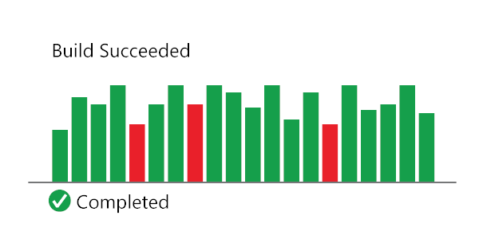

Continuous Integration (CI) is the process of automating the build and testing of code every time a team member commits changes to version control. CI encourages developers to share their code and unit tests by merging their changes into a shared version control repository after every small task completion. Committing code triggers an automated build system to grab the latest code from the shared repository and to build, test, and validate the full main, or trunk, branch.

CI emerged as a best practice because software developers often work in isolation, and then they need to integrate their changes with the rest of the team's code base. Waiting days or weeks to integrate code creates many merge conflicts, hard to fix bugs, diverging code strategies, and duplicated efforts.  CI requires the development team's code be merged to a shared version control branch continuously to avoid these problems.

CI keeps the main branch up-to-date. Teams can leverage modern version control systems such as Git to create short-lived feature branches to isolate their work. A developer submits a pull request when the feature is complete and, on approval of the pull request, the changes get merged into the main branch.  Then the developer can delete the previous feature branch. Development teams repeat the process for additional work. The team can establish branch policies to ensure the main branch meets desired quality criteria.

Teams use build definitions to ensure that every commit to the main branch triggers the automated build and testing processes. Implementing CI this way ensures bugs are caught earlier in the development cycle, which makes them less expensive to fix. Automated tests run for every build to ensure builds maintain a consistent quality.

CI is a standard feature in modern DevOps platforms. GitHub users can start implementing CI today through GitHub Actions. Azure DevOps users can get started with Azure Pipelines.

## Farklı kaynak - What is Continuous Integration?
Continuous Integration is a software development method where team members integrate their work at least once a day. In this method, every integration is checked by an automated build to detect errors. This concept was first introduced over two decades ago to avoid "integration hell," which happens when integration is put off till the end of a project.

In Continuous Integration after a code commit, the software is built and tested immediately. In a large project with many developers, commits are made many times during a day. With each commit code is built and tested. If the test is passed, build is tested for deployment. If the deployment is a success, the code is pushed to Production. This commit, build, test, and deploy is a continuous process, and hence the name continuous integration/deployment.

In this CI tutorial, you will learn:
- [Development without CI vs. Development with CI](#development-without-ci-vs-development-with-ci)
- [Difference between Compilation and Continuous Integration](#difference-between-compilation-and-continuous-integration)
- [What do you need to conduct CI process?](#what-do-you-need-to-conduct-ci-process)
- [How Continuous integration work?](#how-continuous-integration-work)
- [Features of CI](#features-of-ci)
- [Why Use CI?](#why-use-ci)
- [Best practices of using CI](#best-practices-of-using-ci)
- [Disadvantages of CI](#disadvantages-of-ci)
- [Tools for CI process](#tools-for-ci-process)

## Development without CI vs. Development with CI

Here are key differences between development using CI or without CI.

| Development without CI         | Development with CI |
|--------------------------------|---------------------|
| Lots of Bugs                   | Fewer bugs |
| Infrequent commits             | Regular commits |
| Infrequent and slow releases   | Regular working releases |
| Difficult integration          | Easy and Effective Integration |
| Testing happens late           | Continuous Integration testing happens early and often. |
| Issue raised are harder to fix | Find and fix problems faster and more efficiently. |
| Poor project visibility        | Better project visibility |

## Difference between Compilation and Continuous Integration

    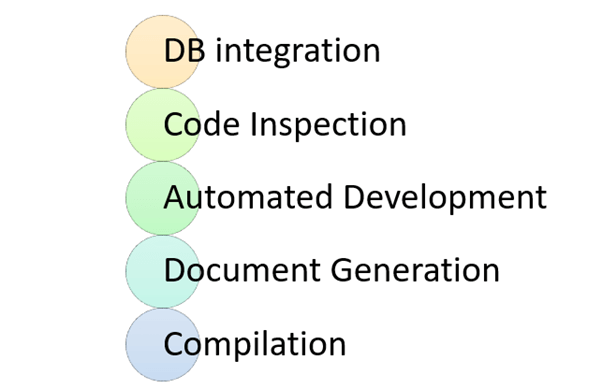

<h4 align="center">Activities in Continuous Integration  </h1>

While compilation only compiles a code, CI does the following activities:

### DB integration:
- Ensure DB and code in sync
- Automated creation of DB and test data.

### Code Inspection:
- Ensures a healthy codebase
- Identifies problems early and applies best practices
### Automated Deployment:
- Allows you to release product anytime
- Continually demo-able state and it is works on any machine
### Document generation:
- Ensure documentation is current
- Removes burned from the developer
- Produces build reports and metrics

### Compilation:
Compilation is the process the computer takes to convert a high-level programming language code into a machine language that the computer able to understand. It ensures a code compiler on every target platform.

### When do I build?
- At every check-in
- Every time a dependency changes

### How do I build?

    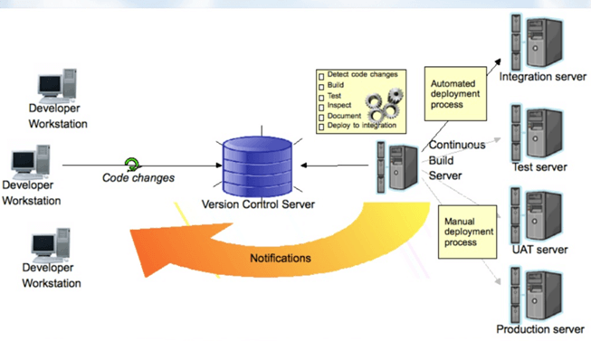

<h4 align="center">CI process  </h1>

- Ideally, the build should come from the command line and should not depend on IDE.
- The build should happen continuously using a dedicated Cl server, not a cron job.
- CI built should be triggered on every check-in and not just at midnight
- The build should provide immediate feedback and Require no developer effort•
- Identify key metrics and track them visually. More importantly, act on them immediately

## What do you need to conduct CI process?

    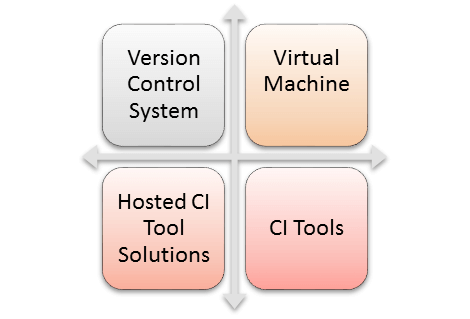

Here, are the key elements which you need to perfom the entire CI process:
- **Version Control System (VCS):** It offers a reliable method to centralize and preserve changes made to your project over time.
- **Virtual Machine:** You should have a spare server or at least one virtual machine to build your system.
- **Hosted CI Tool Solutions:** To avoid servers or virtual machines, you should go for hosted CI tool solutions. This tool helps in the maintenance of the whole process and offers easier scalability.
- **Tools:** If you select a self-hosted variant, you will need to install one of the many CI tools like Jenkins, TeamCity, Bamboo, GitLab, etc.

## How Continuous integration work?

    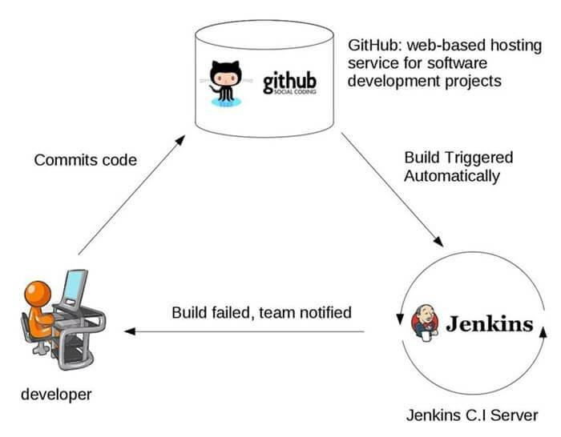

<h4 align="center">Example of Continuous Integration  </h1>

You are surely aware of the old phone Nokia. Nokia used to implement a procedure called nightly build. After multiple commits from diverse developers during the day, the software built every night. Since the software was built only once in a day, it's a huge pain to isolate, identify, and fix the errors in a large codebase.

Later, they adopted the Continuous Integration approach. The software was built and tested as soon as a developer committed code. If any error is detected, the respective developer can quickly fix the defect.

## Features of CI

Here, are important features and benefits of Continuous Integration:
- Allows you to maintain just a single source repository
- You can test the clone of the production CI environment
- The built environment should be close to the production environment.
- One of the advantages of continuous integration is Constant availability of a current build
- The complete process of build and testing and deployment should be visible to all the stack holders.

## Why Use CI

Here are important reasons for using Continuous Integration:
- Helps you to build better quality software
- CI process helps to scale up headcount and delivery output of engineering teams.
- CI allows software developers to work independently on features in parallel.
- Helps you to conduct repeatable testing
- Increase visibility enabling greater communication
- Helps develop a potentially shippable product for fully automated build
- Helps you to reduced risks by making deployment faster and more predictable
- Immediate feedback when issue arrives
- Avoid last-minute confusion at release date and timing

## Best practices of using CI

- Here, are some important best practices while implementing
- Commit Early and Commit Often never Commit Broken Code
- Fix build failures immediately
- Act on metrics
- Build-in every target environment Create artifacts from every build
- The build of the software need to be carried out in a manner so that it can be automated
- Do not depend on an IDE
- Build and test everything when it changes
- The database schema counts as everything
- Helps you to find out key metrics and track them visually
- Check-in often and early
- Stronger source code control
- Continuous integration is running unit tests whenever you commit code
- Automate the build and test everyone
- Keep the build fast with automated deployment

## Disadvantages of CI

Here, are cons/drawbacks of Continuous Integration process:
- Initial setup time and training is required to get acquainted with Cl server
- Development of suitable test procedures is essential
- Well-developed test-suite required many resources for Cl server
- Conversion of familiar processes
- Requires additional servers and environments
- Waiting times may occur when multiple developers want to integrate their code around the same time

## Tools for CI process

Here, are some most essential CI/CD tools:

### Jenkins:

  

Jenkins is an open-source continuous integration software. It is written using the Java programming language. It facilitates real-time testing and reporting on isolated changes in a more massive codebase. This software helps developers to quickly find and solve defects in their codebase & automate testing of their builds.

### Bamboo:

  

Bamboo is a continuous integration build server that performs - automatic build, test, and releases in a single place. It works seamlessly with JIRA software and Bitbucket. Bamboo supports many languages and technologies such as CodeDeply, Ducker, Git, SVN, Mercurial, AWS, and Amazon S3 buckets.

### TeamCity:

  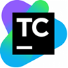

TeamCity is a Continuous Integration server that supports many powerful features. It maintains a CI server healthy and stable even when no builds are running. It provides better code quality for any project

## Summary:
- Continuous Integration definition: Continuous integration is a software development method
- where members of the team can integrate their work at least once a day
- CI/CD meaning combination of Continuous Integration and Continuous Delivery or Continuous
- Deployment.
- Development without CI creates lots of bugs whereas Development with CI offers Fewer bugs•
- Important activities of Continous Integration are 1) DB integration, 2) Code Inspection, 3)
- Automated Deployment, Document generation, and Compilation.
- The build should happen continuously using a dedicated Cl server, not a cron job.
- Important elements of CI are 1) Version Control System 2) Virtual Machine 3) Host CI Tool
- solutions 4) Tools
- Continuous Integration system allows you to maintain just a single source repository
- CI/CD process helps you to build better quality software
- The most important best practices of Azure Continuous Integration process is to Commit Early
- and Commit Often never Commit Broken Code
- The major drawback of the CICD pipeline process is that well-developed test-suite required
- many resources for Cl server
- Jenkins, Bambook, and Team City are some useful AWS Continuous Integration tools.

-----------------------------------------------------------------------------------

# CI/CD Pipeline: Learn with Example
## What is a CI/CD pipeline?
A CI/CD pipeline automates the process of software delivery. It builds code, runs tests, and helps you to safely deploy a new version of the software. CI/CD pipeline reduces manual errors,
provides feedback to developers, and allows fast product iterations.

CI/CD pipeline introduces automation and continuous monitoring throughout the lifecycle of a software product. It involves from the integration and testing phase to delivery and deployment. These connected practices are referred as CI/CD pipeline.

## What is Continuous Integration, Continuous Delivery, and Continuous Deployment?
- **Continuous integration** is a software development method where members of the team can integrate their work at least once a day. In this method, every integration is checked by an automated build to search the error.
- **Continuous delivery** is a software engineering method in which a team develops software products in a short cycle. It ensures that software can be easily released at any time.
- **Continuous deployment** is a software engineering process in which product functionalities are delivered using automatic deployment. It helps testers to validate whether the codebase changes are correct, and it is stable or not.

In this CI/CD Pipeline tutorial, you will learn:
- [Stages of a CI-CD pipeline](#stages-of-a-ci-cd-pipeline)
- [Example of CI-CD Pipeline](#example-of-ci-cd-pipeline)
- [CI-CD pipeline Best Practices](#ci-cd-pipeline-best-practices)
- [Advantages of CI-CD pipelines](#advantages-of-ci-cd-pipelines)
- [Important CI-CD tools](#important-ci-cd-tools)
- [Why Does the CI-CD Pipeline Matter for IT Leaders?](#why-does-the-ci-cd-pipeline-matter-for-it-leaders)
- [CI-CD Pipeline KPI](#ci-cd-pipeline-kpi)

## Stages of a CI-CD pipeline
A CI/CD pipeline is a runnable specification of the steps that any developer should perform to
deliver a new version of any software. Failure in each and every stage triggers a notification via email, Slack, or other communication platforms. It enables responsible developers to know about the important issues.

Here are the important Stages of CI/CD pipeline:

    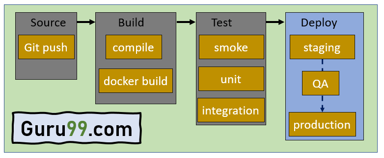

<h4 align="center">Stages of CI/CD pipeline  </h1>

### Source Stage
In the source stage, CI/CD pipeline is triggered by a code repository. Any change in the program
triggers a notification to the CI/CD tool that runs an equivalent pipeline. Other common triggers include user-initiated workflows, automated schedules, and the results of other pipelines.

### Build Stage
This is the second stage of the CI/CD Pipeline in which you merge the source code and its
dependencies. It is done mainly to build a runnable instance of software that you can potentially ship to the end-user.

Programs that are written in languages like C++, Java, C, or Go language should be compiled. On the other hand, JavaScript, Python, and Ruby programs can work without the build stage.

Failure to pass the build stage means there is a fundamental project misconfiguration, so it is better that you address such issue immediately.

### Test Stage
Test Stage includes the execution of automated tests to validate the correctness of code and the behaviour of the software. This stage prevents easily reproducible bugs from reaching the clients. It is the responsibility of developers to write automated tests.

### Deploy Stage
This is the last stage where your product goes live. Once the build has successfully passed through all the required test scenarios, it is ready to deploy to live server.

## Example of CI-CD Pipeline
Here is example of CI/CD pipeline:
- **Source Code Control:** Host code on GitHub as a private repository. This will help you to integrate your application with major services and software.
- **Continuous integration:** Use continuous integration and delivery platform CircleCI and commit every code. When the changes notify, this tool will pull the code available in GitHub and process to build and run the test.
- **Deploy code to UAT:** Configure CitcleCI to deploy your code to AWS UAT server.
Deploy to production: You have to reuse continuous integration steps for deploying code to
UAT.

## CI-CD pipeline Best Practices
Here is a CI/CD pipeline best practices:
- Write up the current development process therefore, you can know the procedures that require to change and one that can be easily automated.
- Start off with a small proof of project before going ahead and complete whole development process at once.
- Set up a pipeline with more than one stage in which fast fundamental tests run first.
- Start each workflow from the same, clean, and isolated environment.
- Run open source tools that cover everything from code style to security scanning.
- Setup a better code hub to continuously check the quality of your code by running the standard set of tests against every branch.
- Peer code review each pull request to solve a problem in a collaborative manner.
- You have to define success metrics before you start the transition to CD automation. This will help you to consistently analyze your software, developing progress help refining where needed.

## Advantages of CI-CD pipelines
Here are the pros/ benefits of CI/CD Pipeline:
- Builds and testing can be easily performed manually.
- It can improve the consistency and quality of code.
- Improves flexibility and has the ability to ship new functionalities.
- CI/CD pipeline can streamline communication.
- It can automate the process of software delivery.
- Helps you to achieve faster customer feedback.
- CI/CD pipeline helps you to increase your product visibility.
- It enables you to remove manual errors.
- Reduces costs and labour.
- CI/CD pipelines can make the software development lifecycle faster.
- It has automated pipeline deployment.
- A CD pipeline gives a rapid feedback loop starting from developer to client.
- Improves communications between organization employees.
- It enables developers to know which changes in the build can turn to the brokerage and to avoid them in the future.
- The automated tests, along with few manual test runs, help to fix any issues that may arise.

## Important CI-CD tools
Here are the important CI/CD tools:
### Jenkins

  

Jenkins is an open-source Continuous Integration server that helps to achieve the Continuous Integration process (and not only) in an automated fashion. Jenkins is free and is entirely written in Java. Jenkins is a widely used application around the world that has around 300k installations and growing day by day.

**Features:**
- Jenkin will build and test code many times during the day.
- Automated build and test process, saving timing, and reducing defects.
- The code is deployed after every successful build and test.
- The development cycle is fast.

Link: https://www.jenkins.io/download/

### Bambo

  

Bamboo is a continuous integration build server that performs - automatic build, test, and releases in a single place. It works seamlessly with JIRA software and Bitbucket. 

**Features:**
- Run parallel batch tests
- Setting up Bamboo is pretty simple
- Per-environment permissions feature allows developers and QA to deploy to their environments
- Built-in Git branching and workflows. It automatically merges the branches.

Link: https://www.atlassian.com/software/bamboo

### CircleCI

  

Circle CI is a flexible CI tool that runs in any environment like a cross-platform mobile app, Python API server, or Docker cluster. This tool reduces bugs and improves the quality of the application.

**Features:**
- Allows to select Build Environment
- Supports many languages including C++, JavaScript, NET, PHP, Python, and Ruby
- Support for Docker lets you configure a customized environment.
- Automatically cancel any queued or running builds when a newer build is triggered.

Link: https://circleci.com/

## Why Does the CI-CD Pipeline Matter for IT Leaders?
- CI/CD pipeline can improve reliability.
- It makes IT team more attractive to developers.
- CI/CD pipeline helps IT leaders, to pull code from version control and execute software build.
- Helps to move code to target computing environment.
- Enables project leaders to easily manage environment variables and configure for the target environment.
- Project managers can publish push application components to services like web services, database services, API services, etc.
- Providing log data and alerts on the delivery state.
- It enables programmers to verify code changes before they move forward, reducing the chances of defects ending up in production.

## CI-CD Pipeline KPI
- **Cycle or Deployment Time:** Cycle time is the time taken to go from the build stage to production. You can obtain average life cycle time by measuring the development process phases. This metric will give insight into bottlenecks in your process and the overall speed of development time.

- **Development Frequency:** Development frequency allows you to analyse bottlenecks you find during automation. The more frequent smaller releases reduce the risk of defects and fix them when found. Such a metric is an overall measure of your team efficiency.

- **Change Lead Time:** It measures the start time of the development phase to deployment. This metric is an indicator of the entire development process and how well the team works together.

- **Change Failure Rate:** It focuses on the number of times development get succeeds vs. the number of times it fails.

- **MTTR vs. MTTF:** MTTR (Mean Time to Recovery) is the amount of time required by your team to recover from failure. MTTF (Mean Time to Failure) measures the amount of time between fixes and outages. These metrics are a reflection of the team's ability to respond and fix issues.

### Summary
- A CI/CD pipeline automates the process of software delivery.
- CI/CD pipeline introduces automation and continuous monitoring throughout the lifecycle of a software product.
- Continuous integration is a software development method where members of the team can integrate their work at least once a day.
- Continuous delivery is a software engineering method in which a team develops software products in a short cycle.
- Continuous deployment is a software engineering process in which product functionalities are delivered using automatic deployment.
- There are four stages of a CI/CD pipeline 1) Source Stage, 2) Build Stage, 3) Test Stage, 4) Deploy Stage.
- Important CI/CD tools are Jenkins, Bambo, and Circle CI.
- CI/CD pipeline can improve reliability.
- CI/CD pipeline makes IT team more attractive to developers.
- Cycle time is the time taken to go from the build stage to production.
- Development frequency allows you to analyse bottlenecks you find during automation.
- Change Lead Time measures the start time of the development phase to deployment.
- Change Failure Rate focuses on the number of times development get succeeds vs. the number of times it fails.
- MTTR (Mean Time to Recovery) is the amount of time required by your team to recover from failure.
- MTTF (Mean Time to Failure) measures the amount of time between fixes and outages.

-----------------------------------------------------------------------------------

# Continuous Integration vs Continuous Delivery vs Continuous Deployment
## What is Continuous Integration?
Continuous integration is a software development method where members of the team can integrate their work at least once a day. In this method, every integration is checked by an automated build to search the error.

In continuous integration after a code commit, the software is built and tested immediately. In a large project with many developers, commits are made many times during a day. With each commit code is built and tested. If the test is passed, build is tested for Deployment. If the Deployment is a success, the code is pushed to production. This commit, build, test, and deploy is a continuous process, and hence the name continuous integration/deployment.

## What is Continuous Delivery?
Continuous delivery is a software engineering method in which a team develops software products in a short cycle. It ensures that software can be easily released at any time. The main aim of continuous delivery is to build, test, and release software with good speed and frequency. It helps you to reduce the cost time and risk of delivering changes by allowing for frequent updates in production.

## What is Continuous Deployment
Continuous deployment is a software engineering process in which product functionalities are delivered using automatic deployment. It helps testers to validate whether the codebase changes are correct and stable or not.

The team can achieve continuous deployment by relying on infrastructure that automates different testing steps. Once each integration meets this release criteria, the application is updated with a new code.

**KEY DIFFERENCES:**
- CI is an approach of testing each change to codebase automatically whereas Continuous Delivery is an approach to obtain changes of new features, configuration, and bug fixes. On the other hand, Continuous Deployment is an approach to develop software in a short cycle.
- CI is performed immediately after the developer checks- in. While in Continuous Delivery, developed code is continuously delivered until the programmer considers it is ready to ship and in Continuous Deployment, developers deploy the code directly to the production stage when it is developed.
- CI uses unit tests on the contrary Continuous Delivery uses business logic tests. In Continuous Deployment any testing strategy is used.
- CI refers to the versioning of source code whereas Continuous Delivery refers to the logical evolution of CI and Continuous Deployment refers to automated implementations of the source code.

## Difference between CI vs CD vs CD
Here is an important difference between CI vs CD vs CD.

| Continuous Integration | Continuous Delivery | Continuous Deployment |
|------------------------|---------------------|-----------------------|
| CI is an approach of testing each change to codebase automatically. | CD is an approach to obtain changes of new features, configuration, and bug fixes. | CD is an approach to develop software in a short cycle. |
| CI refers to the versioning of source code. | CD refers to the logical evolution of CI. | CD refers to automated implementations of the source code. |
| CI focuses on automation testing to determine that the software has no errors or bugs.  | Focuses on releasing new changes to your clients properly. | Emphasis on the change in all stages of your production pipeline. |
| CI is performed immediately after the developer checks-in. | In CD, developed code is continuously delivered until the programmer considers it is ready to ship. | In CD, developers deploy the code directly to the production stage when it is developed. |
| It helps you to identify and rectify issues early. | It allows developers to check software updates. | It enables you to rapidly deploy and validate new features and ideas. |
| It uses unit tests. | It uses business logic tests. | Any testing strategy is performed. |
| Development team sends continuous code merging requests even when the testing  process is running. | You deliver code for review that can be batched for release. | Deploy code using an automated process. |
| You require a continuous integration server to monitor the main repository. | You require a strong foundation in continuous integration. | You need a good testing culture. |

## Advantages of Continuous Integration
Here are the pros/benefits of continuous integration:
- Helps you to build better quality software
- It enables you to conduct repeatable testing.
- CI allows software developers to work independently on features in parallel.
- It can increase visibility and enable greater communication.
- CI process help to scale up Headcount and delivery output of engineering teams.
- Continuous integration helps you to develop a potentially shippable product for a fully automated build.
- Helps you to redue risks by making deployment faster and more predictable
- Immediate feedback when an issue arrives.•
- Avoid last-minute confusion at the release date, and timing automates the build.
- It reduces risks and makes the deployment process more predictable.
- CI provides instant feedback when there is an issue.
- You can see the integration process in real time.
- It can avoid last-minute hassle at release dates.
- The current build is available constantly.
- Provides shippable products on a regular base.
- It is relatively easy to find a history of the software build.
- CI offers code stability.

## Advantages of Continuous Delivery
Here are the pros/benefits of continuous delivery:
- Automate the software release process for making delivery more efficient, rapid, and secure.
- CD practices increase productivity by freeing developers from manual work and complex dependencies.
- It helps you to discover software bugs early in the delivery process.
- CD helps your business team to deliver updates to clients immediately and frequently.
- It ensures the software is always ready to go to production.
- You can release software more frequently, which helps you to get fast feedback from your clients.
- There is less pressure on decisions for small changes.

## Advantages of Continuous Deployment
Here are the pros/benefits of continuous Deployment:
- It helps you to automate the repetitive tasks.
- CD makes your deployment flawless without compromising security.
- Easily scale from a single software application to an enterprise IT portfolio.
- You can ship cloud-native as well as traditional applications.
- It gives a single view across all environments and applications.
- You can connect your existing DevOps tools and scripts into a proper workflow.
- CD enables you to increase overall productivity.
- You can integrate processes and teams with a unified pipeline.

## Disadvantages of Continuous Integration
Here are the cons/ disadvantages of continuous integration:
- Initial setup time and training is required to get acquainted with Cl server
- Well-developed test-suite required many resources for Cl server.
- It requires additional servers and environments.
- You need a conversion of familiar processes in one project.•
- It goes for waiting when multiple developers integrate their code around the same time.
- Your team should write automated tests for each and every new feature or bug fix.
- You require a CI server that monitors the main repository and run the tests for new code commits.
- Developers should merge their changes as more often as possible.
- The unit testing procedure should pass for the Deployment.

## Disadvantages of Continuous Delivery
Here are the cons/disadvantages of continuous delivery:
- You should know continuous integration practices before you go for continuous delivery.
- Deployments are still manual, and hence it takes lots of time to deliver the software product.
- The automated tests should be written and function properly.
- Faulty tests can lead to damage while quality testing.
- It requires team coordination because code changes should be collected regularly in an efficient way.
- Continuous delivery requires a reliable and strong integration server for the automation test that is costly.

## Disadvantages of Continuous Deployment
Here are the cons/disadvantages of continuous Deployment:
- Your testing culture should be good as the quality of the suite determines how good software
releases are.
- Documentation procedures need to keep up with deployment pace.
- Releasing significant changes needs assurance by marketing, help, and support, and other departments.

## Continuous Integration Best Practices
Here are some important best practices while implementing Continuous Integration.
- Automate your software build.
- Keep the build as fast as possible.
- Every commit should result in a build
- Automate Deployment
- Commit early and often.
- You should never commit broken code
- Fix build failures immediately.
- Build-in every target environment Create artifacts from every build
- The build of the software needs to be carried out in a manner so that it can be automated
- Do not depend on an IDE
- Build and test everything when it changes•
- The database schema counts as everything
- Helps you to find out key metrics and track them visually
- Check-in often and early.
- Stronger source code control.
- Continuous integration is running unit tests whenever you commit code.
- Automate the build and test everyone.
- Keep the build fast with automated Deployment.

## Continuous Delivery Best Practices
Here are some important best practices while implementing continuous delivery:
- The first stage must be triggered upon every check-in.
- Each stage should trigger the next one quickly upon successful completion.
- Maintain the version of the source code.
- Perform automated build and Deployment.
- Deploy to one instance of a virtual machine at a time.
- Perform unit and integration tests.
- You have to build your library only once.
- The team should use the same automated release method for each and every environment.
- This method enables you to eliminate conflicts and last-minute problems.
- In case any state fails, you should automatically pause the process and fix the issues.

Continuous Deployment Best Practices
Here are some important best practices while implementing continuous Deployment:
- You should use an issue tracker for the development task.
- In your version controlling system, you should create a branch that contains the issue number and description of any change you have made.
- When software is ready for the Deployment, you can create a pull request for the branch.
- Deployment software to pre-production staging servers.
- Promote your software once you are happy with its quality.

## Challenges of Continuous Integration
Here are the challenges of continuous integration:
- It makes the developing process slow.
- Exposes problems and sharing of issues.
- It may lead to a lack of maintenance of version control.
- It can force you to deal with problems.
- Difficulty in building automated code repository.
- Untested or broken code must not be committed.

## Challenges of Continuous Delivery
Here are the challenges of continuous delivery:
- You need to keep the continuous delivery efficient without bothering the time.
- You need to cope up with tight deadlines release plan.
- Poor product-specific communication of teams may lead to revisions as well as deployment delays.
- The business team should have the budget to have the infrastructure needed to build more impressive software.
- Monitoring data/ information should be utilized by the research and development team.
- The organization should ensure that how open source software fits into the current workflow.

## Challenges of Continuous Deployment
Here are the challenges of continuous deployment:
- CD requires continuous planning to achieve frequent and fast releases.
- Ensure the alignment between the requirement of the business context and application development.
- Rapid delivery must not be isolated to the software development process alone.
- The flow should go with the overall software development cycle.
- Experimental results must be continuously linked with the software roadmap.

-----------------------------------------------------------------------------------

# How To Build a CI/CD Pipeline In Azure DevOps?

Azure DevOps by Microsoft Azure is one of the leading tools that automate CI/CD’s process and, in turn, supports automatic builds and code projects to make them available to others. The Azure pipelines combine Continuous Integration (CI) and Continuous Delivery (CD) to consistently test and build the code and ship it to the target environment.

In this section, we will learn how to configure an Azure CI/CD pipeline and integrate it to Azure DevOps for bug tracking.

Table of Content:
- [What is a CI/CD Pipeline?](#what-is-a-ci-cd-pipeline)
- [What is Azure DevOps?](#what-is-azure-devops)
- [How to build Azure CI-CD Pipeline?](#how-to-build-azure-ci-cd-pipeline)

## What is a CI/CD Pipeline?

A CI/CD pipeline is used to automate the process of continuous integration and continuous deployment. The pipeline facilitates the software delivery process via stages like Build, Test, Merge, and Deploy.

In simple words, a pipeline may sound like an overhead, but it isn’t. Instead, it’s a runnable specification of steps that reduce developers’ manual work by delivering a new version of a software productively and saves time.

**Stages of a CI/CD Pipeline:**
  1. **Source Stage** – In most cases, when a change is attempted to the central repository, a pipeline run is triggered. These triggers are set by the CI/CD pipeline tool in the source stage.
  2. **Build Stage** – The combination of source code and its dependencies when building into a runnable instance corporate to the end-user application. The built-in application languages like Java need compilation too, which is done in the build stage. If docker images are to be constructed, that can also be facilitated in this stage. Failing this stage marks a potential error in the code or its dependencies.
  3. **Test Stage** – This stage corresponds to automated tests running to validate our code and its behavior accordingly. This stage acts as a sieve that prevents the bugs from reaching the end-user. There can be multiple stages, from smoke tests to end-to-end integration tests. Failure at this stage will expose errors in the code.
  4. **Deploy Stage** – Once we have a runnable code, the deployment is processed with all predefined tests passed. There are a lot of stages like “Beta,” “Staging,” etc., for the product team. A “Production” stage for the end-users is also present.

Remember, the stages mentioned above are the basic stages, and different steps can be added to make the CI/CD process more automated. To bring a new life to these stages, we have Azure DevOps CI/CD. 

## What is Azure DevOps?

Azure DevOps is a collection of services given by Microsoft Azure. It provides development services for a team to support, plan, collaborate, build, and deploy applications. It provides integrated features in a browser or an IDE(Integrated Development Environment). Some of the services for developers are:

- Azure Repos
- Azure Pipelines
- Azure Boards
- Azure Test Plans
- Azure Artifacts

These resources are quite useful, especially Azure Pipelines. In this section, we will be using Azure Pipelines to create a CI/CD pipeline for a .NET project.

## What is Azure Pipelines?

The Azure CI/CD pipeline simplifies continuous integration and continuous delivery (CI/CD) in the application development process. You can start from the source stage with existing code on GitHub or on-premise containers. The Azure Repos can maintain a central repository, and the Azure pipelines maintain build and release pipelines for the given project. The Azure DevOps CI/CD process is a crucial process with all the required dev services.

Apart from continuous integration and continuous deployment with Azure DevOps, these pipelines are used to construct build-deploy-test workflows used mainly in continuous testing (CT). This tests the changes in a fast and scalable routine.

## Advantages of Azure Pipelines:

The Azure Pipelines can be multifactored, and in the Azure DevOps CI/CD practice, they provide various advantages:

  1. **Version Control Systems** – Having the code into a version control system is the first step of building an Azure CI/CD pipeline. You can manage your source code in GitHub, Bitbucket, Subversion, or any other Git repository. It also supports Team Foundation Version Control (TFVC).
  
  2. **Programming Languages and Application Types** – You can use different languages with Azure pipelines like Java, Ruby, C, C++, Python, PHP, Go, and JavaScript.
  
  3. **Deployment Targets** – The applications with Azure CI/CD pipelines can be deployed to multiple target environments. This includes Virtual Machines, Containers, or any On-prem or Cloud Platform.

## How to build Azure CI-CD Pipeline?

This is a step-by-step guide to using Azure Pipelines to build a sample application. This guide uses YAML pipelines configured with the [YAML pipeline editor](https://docs.microsoft.com/en-us/azure/devops/pipelines/get-started/yaml-pipeline-editor?view=azure-devops). If you'd like to use Classic pipelines instead, see [Define your Classic pipeline](https://docs.microsoft.com/en-us/azure/devops/pipelines/release/define-multistage-release-process?view=azure-devops).

### Create the first Java pipeline
1. Azure DevOps platformundan üzerinde çalışılan "collection" açılır.

2. Sol menüde yer alan seçeneklerden "Pipelines"a tıklanıp drop-down menü genişletilip çıkan menüdeki "Pipelines"a tıklanır.

  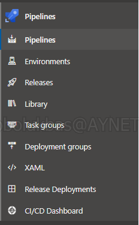

3. İlk defa pipelines oluşturulacakda ekrana gelen "Create your first Pipeline" penceresinin altında yer alan "Create Pipeline" butonuna tıklanır.

  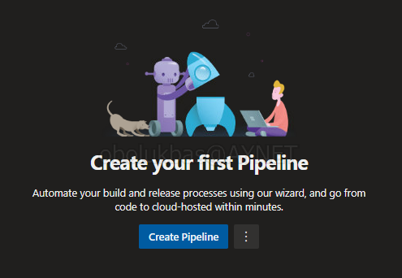

4. Azure DevOps'un yeni versiyonlarında artık varsayılan ayar olarak **yaml** dosyası ile pipeline tanımlanması ve yönetilmesi sağlanmaktadır. 

    - *(Biz de bu dokümanda [Neden Pipeline as Code Yaklasimi Uygulanmali?](#neden-pipeline-as-code-yaklasimi-uygulanmali) başlığının altında avantajlarının açıklandığı "Pipeline as Code" yaklaşımı ile devam edeceğiz.)*

    - *Ekrana gelen pencerenin sol altında yer alan "Use the classic editor" butonu ile klasik pipeline tasarımına devam edilebilir.*

    "Where is your code?" penceresinden "Azure Repos Git" seçilir.

  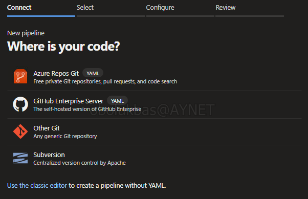

5. Collection altındaki tüm repo'ların sıralandığı pencereden üzerinde çalışacağımız repo seçilir.

  

6. "Configure your pipeline" penceresinde "Maven" seçeneği seçilir.

7. Artık önümüzde **"azure-pipelines.yml"** isimli, pipeline ayarlarımızı içeren ve otomatik oluşturulmuş YAML dosyasının taslak hali yer almaktadır. Buradaki önemli kısımlar:
 - **trigger**: Bu seçenek oluşturacağımız pipeline'ın ne zaman tetikleneceği belirttiğimiz yerdir. Eğer buraya "main" yazarsak main branch'ine, eğer "master" yazarsak veya "develop" yazarsak **"Bu branch'lere her commit geldiğinde bu pipeline'ı tetikle"** komutunu tanımlamış oluyoruz.
   - **pool**: Hangi agent havuzunu kullanacağımızı burada belirtiyoruz. Varsayılan olarak "default" gelmektedir.
   - **steps**: Burada ise pipeline'ımızın sırasıyla çalıştıracağı task'ları belirlemiş oluyoruz.

    Bu örnek için oluşturduğumuz *"azure-pipelines.yml"* dosyası:

    

      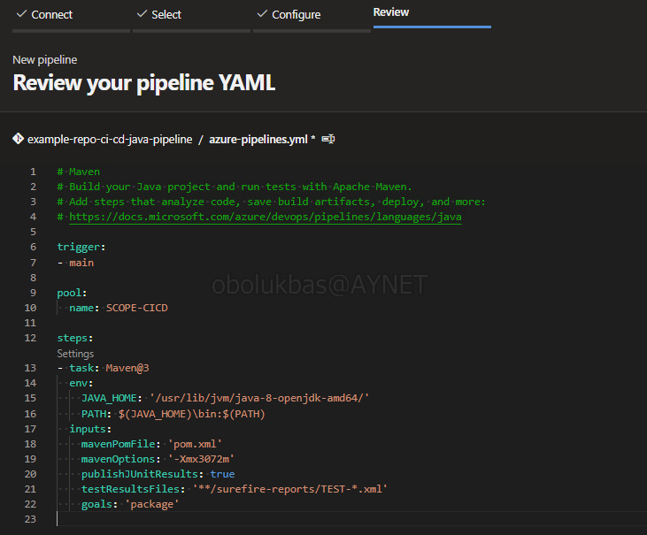
    

    **Pool ismini collection için tanımlı olan agent pool ile değiştirmezsek pipeline çalışacağı agent'ı bulamayacaktır.**

    

      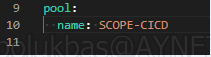
    

8. İlgili kısımları değiştirip istediğimiz komutları ve ayarlamaları yaptıktan sonra sağ üstte yer alan **"Save and run"** butonuna tıklıyoruz. Karşımıza gelen pencere "azure-pipelines.yml" dosyasının direkt main branch'ine mi yoksa yeni oluşturulmak istenen branch'e mi commit edilmesini sormaktadır. 

    *(Eğer pipeline'lar için ayrı bir branch oluşturulmak istenmiyorsa direkt main branch'ine commit atılarak devam edilebilir.)* 

    Ayarlamadan sonra "Save and run" butonuna tıklıyoruz.

  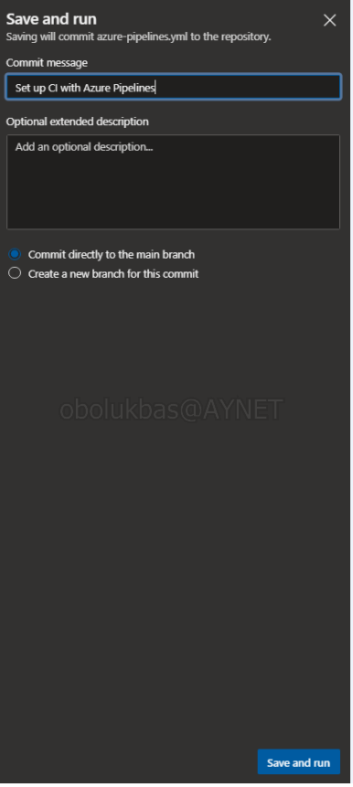

9. Artık karşımızda belirtilen agent tarafından çalıştırılmak üzere sıraya girmiş beklemekte olan pipeline'ın görüntüsü yer almakta:

  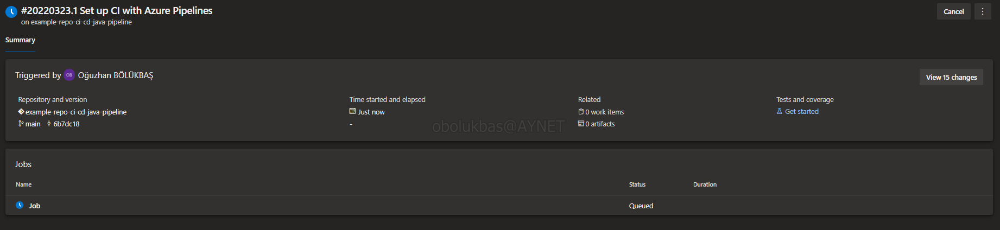

    Eğer aşağıdaki gibi hata alıyorsanız gerekli izinleri vererek hatayı çözebilirsiniz.

  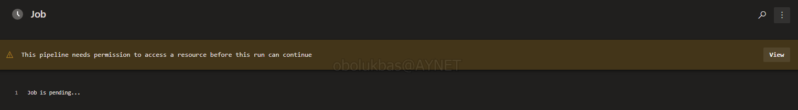

  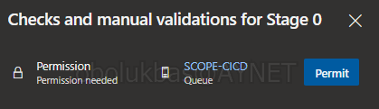

  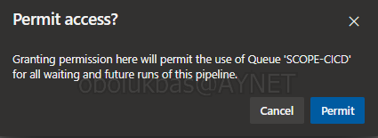

10. İzinler verildiktan sonra derleme işlemine alınan pipeline her bir adımındaki çıktıları tıklanabilir şekilde göstererek işlemi tamamlayacaktır:

  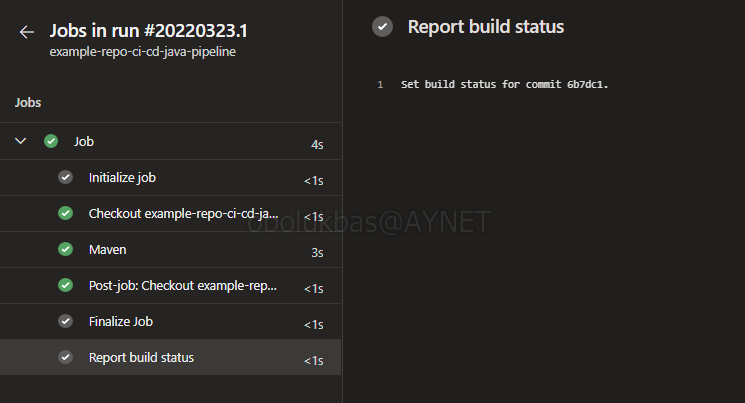

11. Main branch'ine commit geldiğinde tekrar tetiklenmek üzere ayarladığımız pipeline'ımızı test etmek için "Demo.java" dosyasına bir satır ekleyip tekrar commit'liyoruz:

  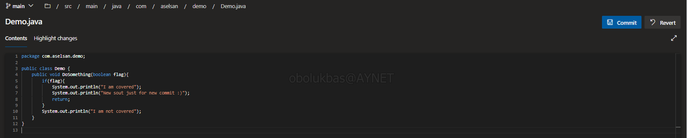

  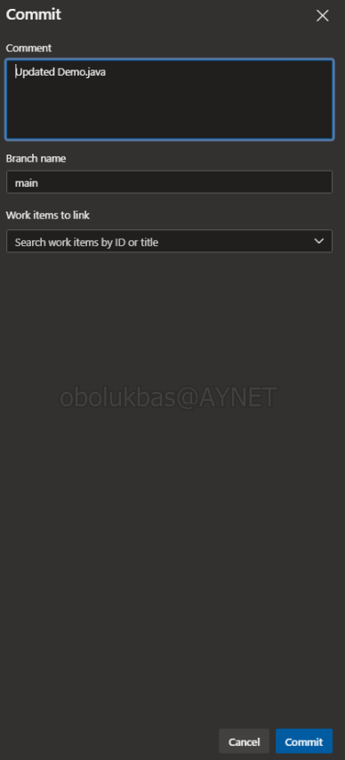

12. Sol menüde yer alan ve daha önceden pipeline oluşturmak için kullandığımız "Pipelines" butonuna tıklayarak derlemeye alınan pipeline'ımızı görmüş oluyoruz. Bu bize main'e gelen commit ile pipeline'ımızın otomatik olarak tetiklendiğini göstermektedir. *(Derleme işlemi tamamlandığında mavi simge yeşile dönüşecektir.)*

  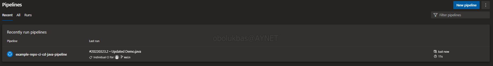

  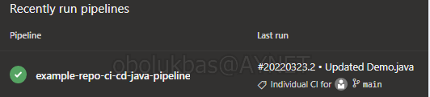

13. "Tik" simgesine dönen pipeline'ımızın üstüne tıkladığımızda karşımıza bu pipeline'ın daha önceki çalıştığı zamanlar çıkmakta. Önceki "Run"larla ilgili ne kadar süre önce çalıştığı, çalışmasının ne kadar sürdüğü, hata ile mi yoksa başarıyla mı sonlandığı bilgileri yer almakta: 

  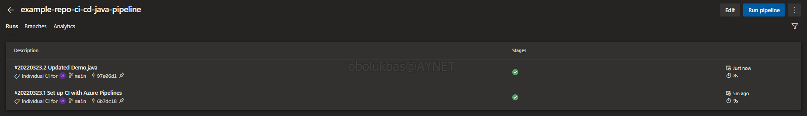

  Herhangi bir çalışmanın (run) içerisine girildiğinde daha da detaylı bilgilere yer verilmekte. 

  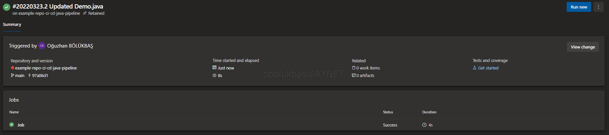

  Bu yeni pencerenin altında yer alan "Jobs" başlığı altındaki "Job"a tıkladığımızda ise çalıştırılmış olan o pipeline'ın step'leri gözükmekte ve üzerlerine tıklanarak detaylı incelenebilmekte. 

  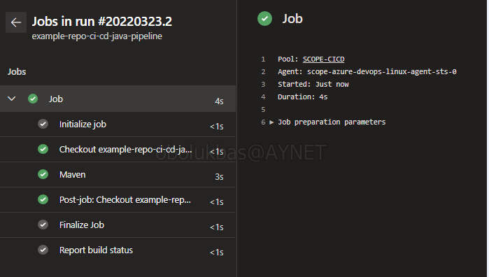

**Bu çalışma ile "example-repo-ci-cd-java-pipeline" repo'su için oluşturulan, SCOPE-CICD havuzundaki agent'lar tarafından derlenen, main branch'ine her commit geldiğinde otomatik olarak tetiklenen, YAML formatındaki "azure-pipelines" dosyası ile konfigüre edilen bir Build Pipeline oluşturmuş olduk. CI adımı için olan bu pipeline'ı CD adımı için olan Release Pipeline takip etmektedir. İkisinin birleştirilmesi ve uç uca çalışması ile CI/CD süreci tamamlanmaktadır.**

-----------------------------------------------------------------------------------

## Dokümanlaştırılacak notlar:

S*r ve H*m projelerinde "Pipeline as Code" yaklaşımı ile geliştirme yapılmakta. 

"Pipeline as Code" yaklaşımı bize pipeline'ları da versiyonlamamızı sağlayacak. Yani iki yıl öncesinin kod'larını ve versiyonları görebileceğimiz gibi o kod'ların pipeline versiyonlarını da görebileceğiz. Kod ile pipeline'lar eşleşmiş olacak, "şu zamanın artifact'ini oluştur" denildiği zaman o versiyon için çalışmış olan pipeline dosyasını kullanıp artifact'i oluşturbilecek hale gelinmesini sağlar.

(Global'de devam eden süreçte developer'lar kendi geliştirdikleri kodun pipeline'ını da yazmaktalar, CI süreçlerinin yönetimi developer'lardadır)

