Continuous Integration (CI) and Continuous Delivery (CD) (or CI/CD) has become an integral part of software development and DevOps testing. It provides developers the necessary features so that they can deploy the code continuously. It detects bugs at an early stage and avoids integration problems due to frequent committing of source code. With so many CI/CD tools available in the market, it becomes essential to choose the best CI/CD tools that suit the budget and project requirements. To make it easy for you, we have created this list, which we hope will help you choose the best CI/CD tool.

In this CI tutorial, you will learn:
- [1-Jenkins](#1-jenkins)
- [2-TeamCity](#2-teamcity)
- [3-CircleCI](#3-circleci)
- [4-Travis CI](#4-travis-ci)
- [5-Bamboo](#5-bamboo)
- [6-GoCD](#6-gocd)
- [7-CodeShip](#7-codeship)
- [8-GitLab CI](#8-gitlab-ci)
- [9-Jenkins X](#9-jenkins-x)
- [10-Shippable](#10-shippable)
- [11-Buildkite](#11-buildkite)
- [12-Concourse CI](#12-concourse-ci)
- [13-Codefresh](#13-codefresh)
- [14-Buddy](#14-buddy)
- [15-Buildbot](#15-buildbot)
- [16-Semaphore](#16-semaphore)
- [17-Wercker](#17-wercker)
- [18-Integrity](#18-integrity)
- [19-Weave Flux](#19-weave-flux)
- [20-Codemagic](#20-codemagic)
- [21-AutoRABIT](#21-autorabit)
- [22-CruiseControl](#22-cruisecontrol)
- [23-Bitrise](#23-bitrise)
- [24-Drone CI](#24-drone-ci)
- [25-UrbanCode](#25-urbancode)
- [26-Strider](#26-strider)
- [27-FinalBuilder](#27-finalbuilder)
- [28-GitHub Actions](#28-github-actions)
- [29-Azure DevOps](#29-azure-devops)
- [30-Terraform](#30-terraform)
- [31-Tekton](#31-tekton)
- [32-Spacelift](#32-spacelift)

# 1-Jenkins

 

# 2-TeamCity

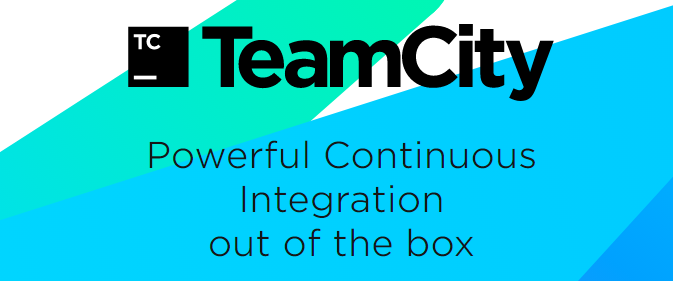

 

# 3-CircleCI

 

# 4-Travis CI

 

# 5-Bamboo

 

# 6-GoCD

 

# 7-CodeShip

 

# 8-GitLab CI

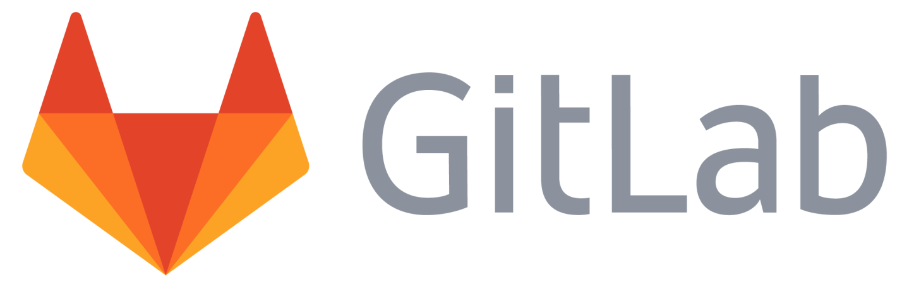

 

# 9-Jenkins X

 

# 10-Shippable

 

# 11-Buildkite

 

# 12-Concourse CI

 

# 13-Codefresh

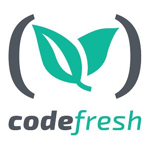

 

# 14-Buddy

 

# 15-Buildbot

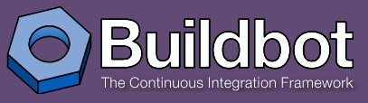

 

# 16-Semaphore

 

# 17-Wercker

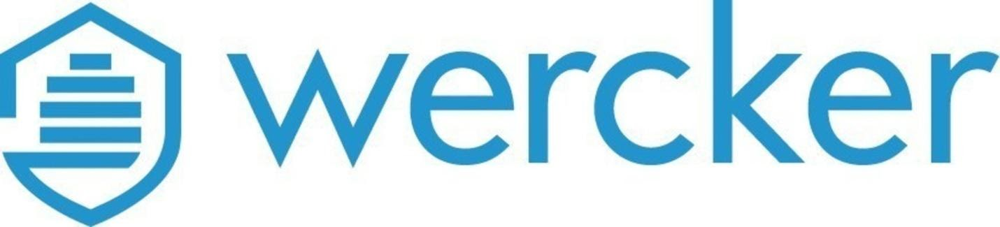

 

# 18-Integrity

 

# 19-Weave Flux

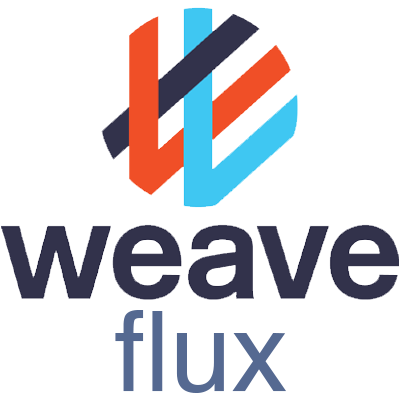

 

# 20-Codemagic

 

# 21-AutoRABIT

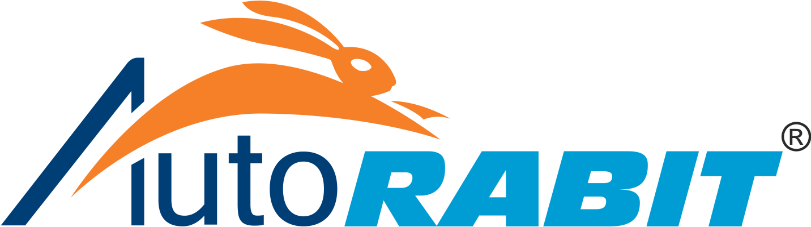

 

# 22-CruiseControl

 

# 23-Bitrise

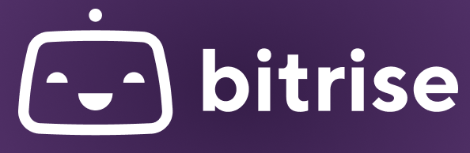

 

# 24-Drone CI

 

# 25-UrbanCode

 

# 26-Strider

 

# 27-FinalBuilder

 

# 28-GitHub Actions

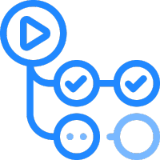

 

# 29-Azure DevOps

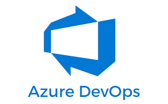

 

# 30-Terraform

 

# 31-Tekton

 

# 32-Spacelift

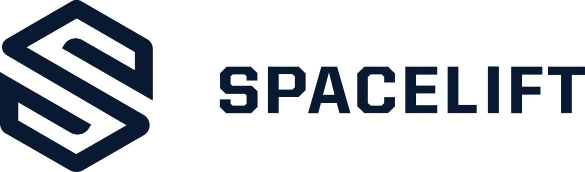

