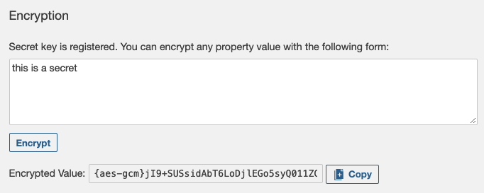

# SonarQube için LDAP Entegrasyonu

### LDAP protokolünün entegrasyonu sayesinde Active Directory kullanımı sağlanıp SonarQube sistemine kişiler kendi kullanıcı adları ve şifreleri ile girip kendilerinin dahil edildiği grupların "permisson policy"lerine dahil olup bu yetkiler kapsamında uygulamanın kullanımı sağlanmaktadır.

## 1-) Şifre şifreleme

*Kullanılan şifreleme algoritması 256-bit key ile AES'tir.*

### **1.1-) "Secret key" oluşturma**
Secret key oluşturmak için **Administration > Configuration > Encryption** yolu takip edilir ve "Generate Secret Key" butonuna tıklanır.

image-1

### **1.2-) Oluşturulan gizli anahtarın SonarQube sunucusuna kaydedilmesi**
 - SonarQube tarafından üretilen gizli anahtar koplayanır 
 
image-2

 - Rancher platformuna giriş yapılıp Storage -> Secrets'a gidilip "Create" butonuna tıklanır.

image-3

image-4

 - Seçenekler arasından "Opaque" seçildikten sonra zorunlu olan "Name*" kısmına Rancher üzerinde gözükecek olan isim yazılıp Data kısmında Key olarak "**sonar-secret.txt**", Value olarak da önceki adımlarda SonarQube'e ürettirdiğimiz gizli anahtar değeri yazılıp "Create" butonu ile Rancher üzerinde gizli anahtar oluşturulmuş olunur.

image-5
 
 - Rancher -> Workload -> StatefulSets'ten SonarQube deployment'ı bulunup "Edit YAML" butonuna tıklanır.

  - "volumes:" altına name olarak gizli anahtarın bilgileri girilir:

image-6

 - SonarQube uygulaması redeploy edilir. 

 -Yeniden ayağa kaldırılan uygulamada **Administration > Configuration > Encryption** altında artık şifre encrypt edilebilmesini sağlayan pencere yer almaktadır

image-7

The default location is ~/.sonar/sonar-secret.txt. If you want to store it somewhere else, set its path through the sonar.secretKeyPath property in $SONARQUBE-HOME/conf/sonar.properties

 - Restrict file permissions to the account running the SonarQube server (ownership and read-access only).

 - Restart your SonarQube server

### **1.3-) Generate the encrypted values of your settings**
Go back to **Administration > Configuration > Encryption** and use the form that has been added to the interface to generated encrypted versions of your values. 

Use the encrypted values in your SonarQube server configuration
Encrypted values can either be set in SonarQube or copied into *$SONARQUBE-HOME/conf/sonar.properties:*

    sonar.jdbc.password={aes-gcm}CCGCFg4Xpm6r+PiJb1Swfg==  # Encrypted DB password
    ...
    sonar.secretKeyPath=C:/path/to/my/secure/location/my_secret_key.txt

Bağlantı: https://docs.sonarqube.org/latest/instance-administration/security/
